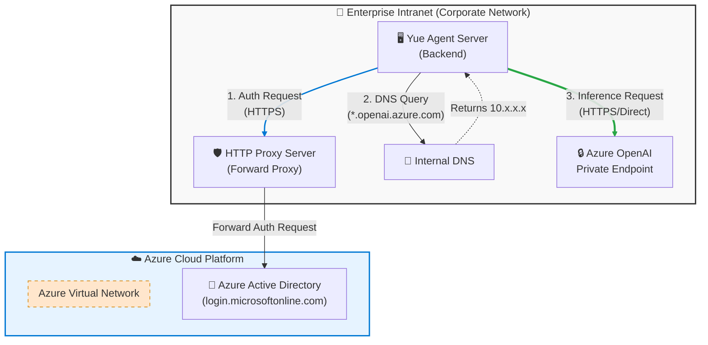
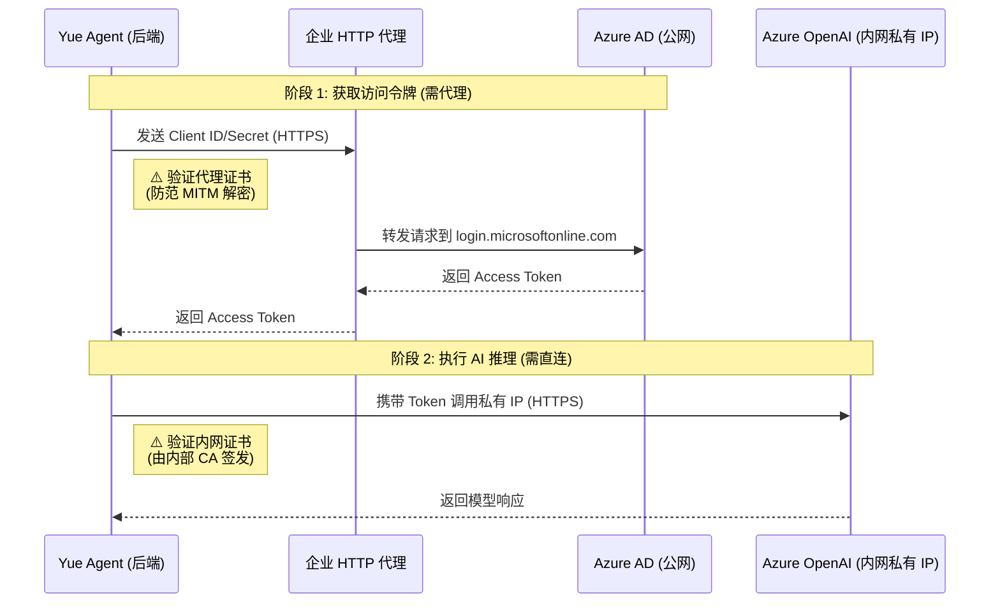
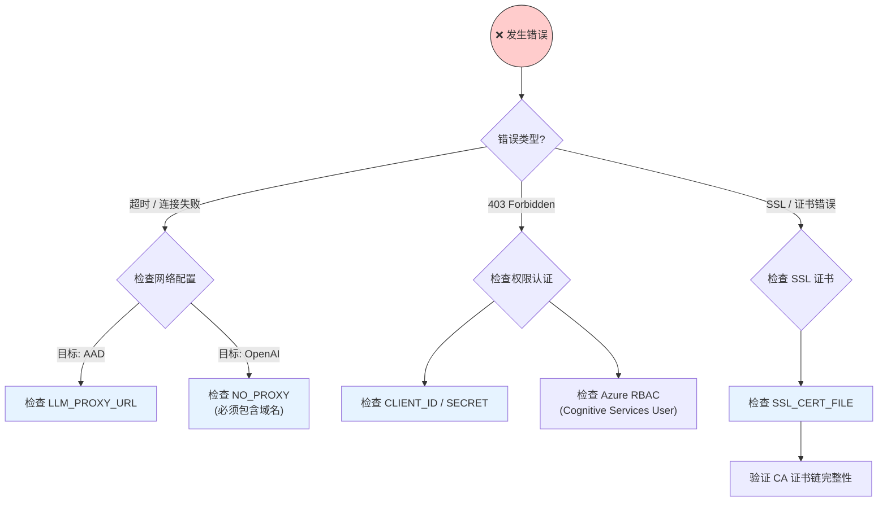

# Azure OpenAI 企业内网环境配置指南

## 1. 核心问题与背景

### 1.1 问题描述
如何在企业内网（Intranet）的复杂网络环境下，正确配置和初始化 **Azure OpenAI** 客户端，特别是需要解决 **身份验证** 与 **模型调用** 走不同网络路径的问题。

### 1.2 背景信息
企业环境通常具有以下特殊的网络架构要求：

*   **身份验证路径 (Auth)**：
    *   使用 **Azure AD (Entra ID)** 进行身份验证。
    *   目标地址是公网的 `login.microsoftonline.com`。
    *   由于内网限制，必须通过 **HTTP Proxy** 才能访问公网。
*   **模型调用路径 (Inference)**：
    *   使用 **Azure OpenAI** 服务。
    *   通过 **Private Endpoint (私有终点)** 部署，域名解析为内网私有 IP（如 `10.x.x.x`）。
    *   由于是内网流量，**严禁走代理**，必须配置 `NO_PROXY` 以实现直连。

### 1.3 解决关键点
系统通过以下机制支持该场景：
*   **Token Provider**: 在请求 Token 时显式使用代理配置。
*   **HTTP Client**: 在初始化 OpenAI 客户端时，注入了包含 `NO_PROXY` 逻辑的 `http_client`，确保推理请求自动绕过代理。

## 2. 核心场景挑战

在典型的企业内网中，AI 应用通常面临两个方向的网络通信：

1.  **公网验证 (Azure AD / Entra ID)**：为了获取访问令牌，应用必须访问 `login.microsoftonline.com`。这通常需要通过企业 **HTTP 代理**。
2.  **内网消费 (Azure OpenAI Private Link)**：为了安全，AI 推理接口被部署在私有终点，域名被解析为内网私有 IP（如 `10.x.x.x`）。此类请求**严禁走代理**，必须直连。

## 3. 网络架构与流量分流

### 网络拓扑架构图



### 流量分流原理图



### 证书验证场景详解

在企业内网中，**几乎所有** HTTPS 通信都需要证书验证，但验证的对象（颁发者）不同：

1.  **阶段 1（走代理时）**：
    *   **现象**：企业代理通常会进行 SSL 卸载或深度包检测（DPI）。它会解密你的流量，检查内容，然后用**企业根证书**重新加密发给你的应用。
    *   **为何需要配置**：如果不信任这个企业根证书，应用会报错 `SSLError: certificate verify failed`，因为它发现证书不是由公网权威 CA（如 DigiCert）签发的。

2.  **阶段 2（直连内网时）**：
    *   **现象**：私有终点（Private Endpoint）通常使用企业内部 CA 签发的证书，或者是默认的 Azure 证书。
    *   **为何需要配置**：
        *   如果是**内部 CA 签发**：必须信任该内部 CA 根证书。
        *   如果是**默认 Azure 证书**（`*.openai.azure.com`）：通常由公网 CA 签发，**不需要**额外配置 `SSL_CERT_FILE`，除非你的服务器连根证书库（Mozilla CA bundle）都被精简掉了。

**结论**：只要你的网络中有“拦截者”（代理）或者“自签发者”（内网服务），你就需要配置 `SSL_CERT_FILE` 来让 Python 信任它们。

## 4. 关键配置项详解

为了实现上述分流，应用需要正确配置以下环境变量：

| 环境变量 | 典型值 | 作用 |
| :--- | :--- | :--- |
| `AZURE_OPENAI_BASE_URL` | `https://your-resource.openai.azure.com/` | Azure OpenAI 服务的访问终点。 |
| `LLM_PROXY_URL` | `http://proxy.corp.com:8080` | 企业代理服务器地址，用于访问 AAD。 |
| `NO_PROXY` | `your-resource.openai.azure.com` | **核心配置**。确保对 AI 服务的调用绕过代理，直接通过内网。系统默认已包含 `localhost`, `127.0.0.1` 等回环地址。 |
| `AZURE_TENANT_ID` | `xxxxxxxx-xxxx-...` | Azure 租户 ID，用于身份验证。 |
| `AZURE_CLIENT_ID` | `xxxxxxxx-xxxx-...` | 企业应用注册的客户端 ID。 |
| `AZURE_CLIENT_SECRET` | `********` | 企业应用注册的客户端密钥。 |
| `SSL_CERT_FILE` | `/path/to/cert.pem` | (可选) 自定义 CA 证书路径，用于信任企业自签证书或代理证书。 |

## 5. SSL 证书配置 (可选)

在企业环境中，经常会遇到 SSL 证书信任问题（`SSLError`），通常由以下两种情况引起：

1.  **代理拦截 (MITM)**：企业 HTTP 代理会对 HTTPS 流量进行解密审查，并重新签发证书。
2.  **内网自签证书**：Azure Private Endpoint 使用的企业内部 CA 签发的证书，默认不被信任。

### 配置方法

如果遇到证书报错，请导出企业根证书（通常为 `.pem` 或 `.crt` 格式），并设置环境变量：

```bash
export SSL_CERT_FILE=/path/to/corporate-ca-bundle.pem
```

### 代码处理逻辑
在 [model_factory.py](../backend/app/services/model_factory.py) 中，系统会将该证书同时应用于：
- **Token 获取**：信任代理服务器的证书。
- **模型调用**：信任内网 OpenAI 服务的证书。

```python
ssl_cert_file = llm_config.get('ssl_cert_file')
verify = ssl_cert_file if ssl_cert_file else True

# 应用于 httpx.AsyncClient
client = httpx.AsyncClient(..., verify=verify)
```

## 6. 后端代码实现逻辑

项目在 [model_factory.py](../backend/app/services/model_factory.py) 中通过以下机制处理此类复杂逻辑：

### A. 智能 Token 换取
在获取 Azure 令牌时，系统会显式创建一个支持代理的 `httpx.Client`。由于 `login.microsoftonline.com` 不在 `NO_PROXY` 中，它会自动通过代理完成认证。

### B. 统一的 Proxy 管理
在 [_get_proxies_config](../backend/app/services/model_factory.py#L75-L97) 函数中，系统构建了符合 `httpx` 规范的代理字典：

```python
def _get_proxies_config(llm_config: Dict[str, Any]) -> Optional[Dict[str, str]]:
    proxy_url = llm_config.get('proxy_url')
    no_proxy = llm_config.get('no_proxy')
    
    if not proxy_url:
        return None
    
    # 默认走代理
    proxies = {"all://": proxy_url}
    
    # 1. 硬编码通用的本地回环地址，确保本地服务（如 Ollama）始终直连
    common_no_proxy = ["localhost", "127.0.0.1", "::1", "0.0.0.0"]
    for host in common_no_proxy:
        proxies[f"all://{host}"] = None
    
    # 2. 排除 NO_PROXY 中的自定义地址
    if no_proxy:
        for host in no_proxy.split(','):
            proxies[f"all://{host.strip()}"] = None
                
    return proxies
```

### C. 注入 AI 客户端
当初始化 `AsyncAzureOpenAI` 或 `OpenAIChatModel` 时，会将上述带有 `NO_PROXY` 逻辑的 `http_client` 注入，确保推理请求根据配置自动决定是否走代理。

## 7. 常见问题排查

### 故障诊断流程图



### 常见错误列表

- **403 Forbidden**: 通常是 `AZURE_CLIENT_ID` 或 `AZURE_CLIENT_SECRET` 错误，或者该应用未被授予 Azure OpenAI 的权限。
- **连接超时 (Timeout)**: 
    - 如果是 AAD 超时，检查 `LLM_PROXY_URL` 是否正确。
    - 如果是 OpenAI 超时，检查是否需要将域名加入 `NO_PROXY`（对于私有终点）。
- **SSL 证书错误 (SSLError)**: 提示 "certificate verify failed" 或 "self signed certificate in certificate chain"。
    - 请检查是否已设置 `SSL_CERT_FILE`。
    - 确保提供的 `.pem` 文件包含了完整的证书链（Root CA + Intermediate CA）。
- **域名解析错误**: 确保内网 DNS 已正确将 `.openai.azure.com` 映射到私有 IP。

---
*本文档由 Yue Agent 自动生成，用于指导企业内网环境下的部署配置。*
