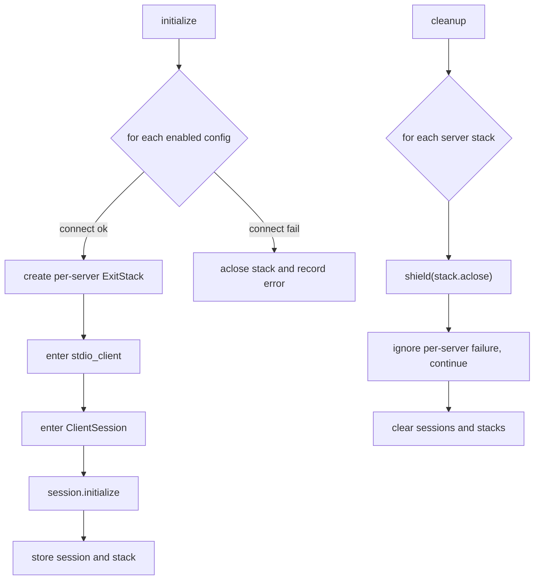

# MCP 生命周期清理改进设计说明（Per-Server ExitStack + Shielded Cleanup）

## 1. 背景

Yue 后端在启动时会初始化 MCP（Model Context Protocol）连接，并在 FastAPI lifespan 结束时清理所有连接：

- 初始化： [backend/app/main.py](../backend/app/main.py)
- MCP 管理器： [backend/app/mcp/manager.py](../backend/app/mcp/manager.py)
- 运行期可触发重载：`POST /api/mcp/reload`（先 cleanup 再 initialize） [backend/app/api/mcp.py](../backend/app/api/mcp.py)

在 Phase 6 稳定性治理中，我们观察到在关停/重载 MCP 时存在 anyio cancellation 相关的异常（例如 cancel scope/CancelledError 相关日志），需要做工程化治理，以保证：

- 服务关停/重载时不出现“半关闭/未关闭”的不确定状态
- 连接资源不会泄漏（stdio 子进程、管道、session 等）
- 单个 MCP server 异常不会影响其它 server 的收敛

本设计文档说明为何要做此改进，以及具体采取的方案与权衡。

## 2. 问题描述

### 2.1 现象（Symptoms）

在以下场景中，MCP 清理阶段会出现取消相关异常或清理不完整的风险：

- FastAPI/uvicorn 关停（lifespan shutdown）
- 调用 `POST /api/mcp/reload` 进行 MCP 重载
- 测试环境中频繁起停后端进程（例如集成测试反复启动 uvicorn）

这些异常通常不一定导致进程立即崩溃，但会带来两个工程风险：

- **非确定性清理**：某些连接/子进程未被关闭，导致资源泄漏与后续连接异常
- **错误噪声**：关停日志持续出现取消相关 stacktrace，影响排障信噪比

### 2.2 根因分析（Root Cause）

历史实现将所有 MCP server 的资源都挂在同一个 `AsyncExitStack` 上（共享栈），并在 cleanup 阶段一次性 `aclose()`：

- 多 server 共享资源栈：同一个 ExitStack 内可能包含多个 stdio client、多个 ClientSession
- cleanup 与关停流程的取消信号可能同时发生：当外层 task 被取消时，`aclose()` 可能被中断
- “一次性关闭所有资源”的异常传播路径更复杂：某一个 server 的关闭异常可能影响整个 stack 的关闭流程

因此，我们需要把“清理的可靠性”从“尽力而为”提升到“尽可能确定、局部失败可隔离”。

## 3. 设计目标（Goals / Non-goals）

### 3.1 目标

- **确定性释放**：尽最大可能确保每个 MCP server 的连接资源被关闭
- **失败隔离**：某一 server 的关闭异常不应阻断其他 server 的关闭
- **取消鲁棒性**：面对 shutdown/reload 的取消信号，cleanup 仍尽量完成（或至少完成关键步骤）
- **行为兼容**：不改变外部 API 协议与工具行为；仅增强资源管理与稳定性

### 3.2 非目标

- 不引入新的 transport（仍以 stdio 为主，SSE TODO 不在本改动范围）
- 不改变 MCP 工具枚举/调用的业务语义
- 不在本阶段引入更复杂的连接健康检查或自动重连策略

## 4. 方案选型

### 4.1 方案 A：仍使用单一全局 ExitStack（不推荐）

优点：
- 改动最少

缺点：
- 无法隔离单个 server 的关闭失败
- cleanup 被取消时更容易出现“半关闭”状态

### 4.2 方案 B：Per-Server ExitStack（采纳）

核心思路：
- 每个 MCP server 连接时创建独立的 `AsyncExitStack`
- 该 server 的 `stdio_client`、`ClientSession` 进入该 stack
- cleanup 时逐个关闭每个 server 的 stack，单点失败不影响整体

优点：
- 失败隔离明确（按 server 粒度）
- 关闭顺序更可控
- 更容易做 server 粒度的重连/重载（未来演进空间更大）

潜在缺点：
- 需要维护额外的 `name -> stack` 映射与状态一致性

### 4.3 取消鲁棒性：Shielded Cleanup（采纳）

在 cleanup 时使用 `asyncio.shield(stack.aclose())`：

- 目的：减少外层取消信号把 cleanup 中途打断的概率
- 同时对 `CancelledError` 做兜底：即使被取消，仍尽力执行 `aclose()`

权衡：
- shield 会延长关停时长的上限（因为 cleanup 更“坚持完成”）
- 但换来更可靠的资源回收与更少的偶发错误噪声

## 5. 最终方案设计

### 5.1 数据结构与状态

在 McpManager 内引入：

- `self._server_exit_stacks: Dict[str, AsyncExitStack]`：每个 server 一个资源栈
- `self.sessions: Dict[str, ClientSession]`：server 到 session 的映射保持不变

关键不变式：

- 若 `name in self.sessions`，则应同时满足 `name in self._server_exit_stacks`
- connect 失败时，不允许把半初始化 stack 挂进映射（失败必须先 `aclose()` 再抛错）
- cleanup 后，`sessions` 与 `_server_exit_stacks` 都应清空

### 5.2 生命周期流程图

### 5.3 关键实现点

- 连接阶段：
  - 为每个 server 创建独立 `AsyncExitStack`
  - 任何连接中间失败都要先关闭 stack（避免泄漏）再向上抛出
- 清理阶段：
  - 复制栈列表后清空映射（避免并发访问时状态不一致）
  - 对每个 stack 使用 `asyncio.shield`，并捕获 `CancelledError` 兜底

对应实现文件：

- [backend/app/mcp/manager.py](../backend/app/mcp/manager.py)

## 6. 测试与验收

本次改动是资源管理层面的增强，核心验收点是“不破坏现有行为 + 稳定可回归”。

### 6.1 自动化回归

- 后端单测全量通过：`python3 -m unittest discover backend/tests -v`
- 前端 e2e 全量通过：`cd frontend && npm run test:e2e`
- MCP reload 冒烟（已有用例）：[backend/tests/test_mcp_and_models.py](../backend/tests/test_mcp_and_models.py)

### 6.2 手工验收建议（可选）

- 反复调用 `POST /api/mcp/reload` 观察后端日志，确认关停阶段不再出现高频 cancel scope 噪声
- 在启用多个 stdio MCP server 配置时，验证某一个 server 故障不会影响其它 server 工具枚举

## 7. 回滚策略

触发条件：
- MCP 重载后工具列表异常、session 无法恢复、或出现新的清理异常

回滚方式：
- 将 MCP manager 恢复为“单一全局 AsyncExitStack”的实现（移除 `_server_exit_stacks`，回到统一 `enter_async_context` + `aclose`）

回滚影响面：
- 仅影响 MCP 生命周期管理与稳定性；不影响 docs 工具协议、引用策略、UI 展示等功能逻辑

## 8. 后续工作（Future Work）

- 在 `cleanup()` 中按 server 粒度记录关闭耗时（便于定位慢关闭与卡死）
- 对 stdio 子进程增加更明确的健康检查/超时退出策略
- 在 `reload` 时支持“差量重载”（仅重连变更的 server），进一步降低中断与抖动
