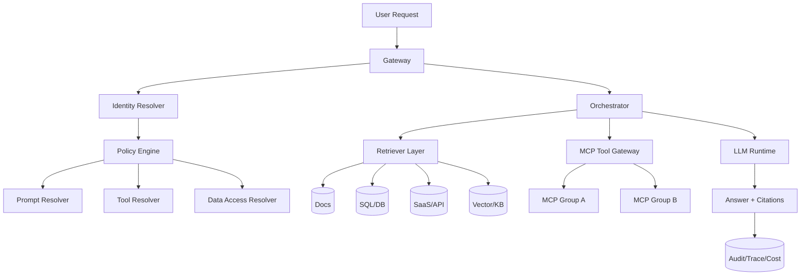

# Yue 需求分析与多框架选型对比报告（多数据源 + 分群可见性）

## 1. 报告目标

本报告用于回答三件事：

1. **总结当前 Yue 的真实需求与能力边界**（基于代码与现有文档）。
2. **面向未来目标做需求升级建模**：支持多数据源问答、按用户群体隔离数据可见性、分群 system prompt、分群 MCP 工具权限。
3. **在同一评估框架下对比 7 个技术栈**：  
   - Google ADK  
   - Pydantic AI  
   - LangChain（含 LangGraph）  
   - LlamaIndex  
   - CrewAI + CrewAI Tools  
   - Semantic Kernel  
   - AutoGen AgentChat

---

## 2. 当前项目需求基线（As-Is）

## 2.1 已落地能力

从代码与文档可确认，Yue 当前是一个“**多模型 + MCP 工具 + 文档检索问答 + 引用溯源**”平台：

- 后端核心：FastAPI + Pydantic AI + SQLite  
- 已支持多模型供应商切换（OpenAI/DeepSeek/Zhipu/Ollama 等）  
- Agent 具备可配置的 `system_prompt`、`enabled_tools`、`doc_roots`、`doc_file_patterns`、`require_citations`、`skill_mode`  
- MCP 工具管理具备配置、状态、热重载、工具枚举能力  
- 文档访问有 `allow_roots` / `deny_roots` 安全边界，且在检索与读取链路中强制校验  
- 对“文档型回答”强化 citations（路径/行号/片段）输出

## 2.2 隐含产品定位

当前产品更接近“**可配置 Agent 工作台**”，而不是单一 chatbot：

- 用户可按 Agent 绑定不同工具与不同提示词
- 文档检索能力强调可验证、可回溯、安全可控
- 平台强调可运维（模型管理、MCP 状态、配置中心）

## 2.3 关键缺口（与未来目标相关）

为了满足“多数据源 + 分群隔离”，当前仍缺：

1. **身份域模型不足**  
   - 会话层目前无显式 `user_id / tenant_id / group_id / role` 等核心字段。

2. **授权策略尚未中心化**  
   - 现有主要是 Agent 级工具白名单与文档根目录白名单；缺统一策略决策点（PDP）与策略执行点（PEP）体系。

3. **数据源接入模型偏文档导向**  
   - 本地文档读取强，但尚未形成标准化多数据源连接器层（DB/API/BI/对象存储/知识库等）。

4. **分群 Prompt 与分群 MCP 尚未产品化**  
   - 当前可通过 Agent 配置实现“变体”，但缺少“组织级模板 + 人群映射 + 运行时强校验”机制。

---

## 3. 目标需求模型（To-Be）

假设未来需求如下：

- 支持从多个数据源检索并回答（本地文档、数据库、SaaS API、企业知识库、外部检索服务）
- 不同用户群体可见数据不同（例如研发/财务/法务）
- 不同用户群体使用不同 system prompt
- 不同用户群体可调用不同 MCP 工具集

可抽象成 4 个一等公民（First-class Citizens）：

1. **Identity**：user / group / tenant / role
2. **Policy**：data_policy / tool_policy / prompt_policy
3. **Context**：数据源路由、检索约束、引用要求
4. **Execution**：Agent 编排、工具调用、审计与回放

---

## 4. 目标架构（建议）

核心原则：

- **先鉴权再检索**：数据访问限制不放在提示词里“软约束”，必须代码层硬约束
- **提示词按群体模板化**：运行时只拼接允许模板，不让用户直接覆盖高危指令段
- **MCP 走策略网关**：调用前进行工具白名单与参数级约束检查
- **答案必须可审计**：至少记录 user/group、策略版本、数据源命中、工具调用链、引用证据

---

## 5. 选型评估维度

本次对比使用 8 个维度：

1. 多智能体编排能力（workflow/MAS）
2. 多数据源接入与 RAG 生态
3. 分群隔离与策略落地能力
4. MCP/工具体系成熟度
5. 可观测性、评测与可审计性
6. 工程复杂度与学习曲线
7. 生态成熟度与社区风险
8. 与 Yue 当前 Python 技术栈匹配度

---

## 6. 七框架对比

## 6.1 Google ADK

**优势**
- 原生 Workflow Agents（Sequential/Parallel/Loop）与多智能体层级编排清晰
- 强调部署与评测闭环，适合规模化 agent 系统
- 对“复杂编排”语义天然友好

**风险/成本**
- 在 Python 业务栈中需要引入新编排心智与运行模型
- 若不走 Google 生态，部分优势不一定完全释放

**适用度**
- 复杂 MAS、高编排需求：高
- 快速业务落地：中

## 6.2 Pydantic AI

**优势**
- Python 类型安全强、工具/依赖注入体验好，开发效率高
- 对 MCP、流式、HITL、durable execution 友好
- 便于与当前 FastAPI/SQLite/MCP 架构融合

**风险/成本**
- 多智能体编排需要自建上层 orchestration（或组合其他框架）

**适用度**
- 业务型 agent 平台：高
- 极复杂多代理编排：中（需增强）

## 6.3 LangChain（含 LangGraph）

**优势**
- 生态庞大，连接器与工具生态丰富
- LangGraph 在持久化、HITL、中断恢复、状态流上成熟
- 适合“流程 + 代理”混合编排

**风险/成本**
- 概念与版本演进较快，需治理依赖与抽象边界
- 若使用不当容易形成复杂链路，调试成本上升

**适用度**
- 需要大量连接器与编排能力：高
- 团队需较强工程规范：中高

## 6.4 LlamaIndex

**优势**
- 在数据接入、索引、检索、路由、metadata filtering 方面强
- 多数据源 RAG 与多租户检索隔离模式成熟（按 metadata 过滤）
- 对“多源问答 + 引用证据”场景非常契合

**风险/成本**
- 若把它扩展为全栈 Agent 编排框架，可能与其他编排层职责重叠

**适用度**
- 数据源编排与检索中台：很高
- 全栈 Agent runtime：中

## 6.5 CrewAI + CrewAI Tools

**优势**
- 多角色协作（Crew）表达直观
- CrewAI Tools 与 MCP 整合路径明确，适合工具化任务团队

**风险/成本**
- 在企业级策略治理、可审计性和长期稳定抽象上需额外验证
- 与现有平台深度融合时，需要定义边界（避免“第二套调度系统”）

**适用度**
- 任务协作型自动化：中高
- 平台内核：中

## 6.6 Semantic Kernel

**优势**
- 企业导向明显，插件（Plugin）与编排能力体系化
- 多代理协作、函数调用、企业治理语境较强
- 对 .NET 生态团队非常友好

**风险/成本**
- Python 团队会有额外学习与生态融合成本
- 部分能力在不同语言 SDK 的成熟度不一致

**适用度**
- 跨语言企业体系、微软生态：高
- 当前纯 Python 快速落地：中

## 6.7 AutoGen AgentChat

**优势**
- 多代理会话与团队模式表达能力强，实验与研究迭代快
- AgentChat 高层 API 上手快，适合快速验证协作模式

**风险/成本**
- 版本代际变化较快，生产治理需提前设计稳定层
- 在企业级“策略控制 + 数据隔离 +审计”上仍需你自建强约束

**适用度**
- 多代理交互原型与探索：高
- 强治理生产平台：中

---

## 7. 面向 Yue 未来目标的结论

## 7.1 单一框架结论（只选一个）

若必须单选一个作为主框架：

- **推荐优先：Pydantic AI（主运行时）**

理由：

1. 与当前 Python/FastAPI/MCP 工程基因最匹配
2. 在“分群提示词 + 分群工具白名单 + 可审计链路”上改造成本最低
3. 能快速先交付业务，再渐进增强编排

## 7.2 组合方案结论（更推荐）

若允许组合，我更推荐：

- **Pydantic AI（Agent Runtime） + LlamaIndex（多数据源检索中台） + 轻量 LangGraph/自研编排层（复杂流程）**

组合价值：

- Pydantic AI 负责运行时稳定性、工具调用、类型安全
- LlamaIndex 负责多数据源接入、索引、检索路由、metadata 过滤（分群隔离关键）
- LangGraph 或自研编排负责复杂流程状态机、中断恢复、HITL 审批流

---

## 8. 分阶段落地蓝图（建议）

## Phase 1：身份与策略底座（必须先做）

- 增加 `user_id / tenant_id / group_id / role` 到会话与调用上下文
- 引入统一策略模型：`prompt_policy`, `tool_policy`, `data_policy`
- 所有工具调用和数据检索统一经过策略检查

## Phase 2：多数据源接入中台

- 抽象 DataSource Connector 接口（docs/sql/api/vector）
- 引入统一检索请求契约：query、filters、group_scope、time_range、top_k
- 强制返回标准 citations（source_id/path/locator/confidence）

## Phase 3：分群 Prompt 与分群 MCP

- Prompt 模板中心（按 group/version 管理）
- MCP 目录按 group 暴露，工具参数做 schema 与策略双校验
- 加入“策略变更审计”与灰度发布

## Phase 4：编排与质量闭环

- 增加复杂任务编排（并行检索、汇总、复核）
- 建立评测集：正确率、引用完整率、越权拦截率、P95 延迟、成本
- 上线可观测看板：模型、工具、数据源、租户维度

---

## 9. 风险与治理建议

1. **越权风险**：必须把授权放在代码层，不依赖 prompt 文本约束  
2. **多源一致性风险**：建立来源优先级与冲突处理规则  
3. **提示词漂移风险**：Prompt 模板版本化 + 回滚机制  
4. **框架耦合风险**：通过统一领域接口隔离底层框架（Anti-Corruption Layer）

---

## 10. 最终建议（可执行）

- **主线建议**：以 **Pydantic AI** 为主运行时框架，优先补齐“身份-策略-数据源”三层能力。  
- **检索建议**：引入 **LlamaIndex** 作为多数据源检索与路由中台。  
- **编排建议**：当复杂流程增多时，再引入 **LangGraph 或 ADK 风格编排模式**，避免前期过度设计。  
- **保留观察**：CrewAI、Semantic Kernel、AutoGen 可用于专项 PoC（多代理协作、企业编排、研究型任务），但不建议立即替换主运行时。

---

## 11. 代码证据索引（Yue）

- 需求与路线图：`docs/PROJECT_REQUIREMENTS.md`、`docs/ROADMAP.md`
- Agent 配置模型：`backend/app/services/agent_store.py`
- Chat 运行链路：`backend/app/api/chat.py`
- MCP 配置与状态 API：`backend/app/api/mcp.py`
- 配置中心与 doc_access：`backend/app/api/config.py`、`backend/app/services/config_service.py`
- 文档访问控制与检索实现：`backend/app/services/doc_retrieval.py`、`backend/app/mcp/builtin/docs.py`
- 工具授权与转换：`backend/app/mcp/registry.py`
