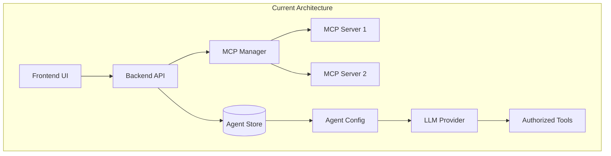

# Skill Architecture Analysis Report

*Generated on February 14, 2026*  
*Based on analysis of current implementation and future opportunities*

## Executive Summary

This document provides a professional analysis of the current skill and agent architecture in the Yue platform, identifies architectural gaps, and proposes concrete implementation recommendations to evolve the system from a "tool-equipped chatbot" into a true **multi-agent platform** with reusable skill modules and hierarchical agent orchestration.

The analysis reveals strong foundations in MCP tool integration and agent configuration, with opportunities to introduce **skill modularity**, **coordinator-subagent patterns**, and **deterministic script execution** to achieve greater scalability, context efficiency, and reliability.

## Current Implementation Analysis

### Strengths (What Already Works Well)

1. **MCP Tool Registry**: Robust connection to external tools via MCP servers with proper error handling and configuration management
2. **Agent Configuration System**: Flexible agent definitions with system prompts, enabled tools, document scopes, and citation policies
3. **Built-in Specialists**: Two predefined agents (Docs, Local Docs) with domain-specific prompts and citation enforcement
4. **Smart Generation**: LLM-assisted agent creation via `/api/agents/generate` endpoint with tool normalization
5. **Security Model**: Proper agent-tool authorization with explicit allow lists and safety defaults

### Architecture Overview



**Key Components**:
- **`backend/app/api/mcp.py`**: MCP API endpoints for tool management
- **`backend/app/mcp/manager.py`**: MCP server connection and tool lifecycle management
- **`backend/app/services/agent_store.py`**: Agent configuration persistence
- **`backend/app/api/agents.py`**: Agent CRUD and generation endpoints
- **`frontend/src/pages/Agents.tsx`**: Agent management UI with Smart Generate

## Identified Gaps & Opportunities

| Gap | Impact | Priority | Description |
|-----|--------|----------|-------------|
| **No reusable skill modules** | Duplicate effort configuring similar agents; inconsistent expertise | High | Each agent must be manually configured with tools and prompts, even for common domains like "frontend" or "database" |
| **Flat agent architecture** | Context pollution; no isolation for complex tasks | High | All tools and context share the same LLM session, leading to token waste and error propagation |
| **Static tool discovery** | Tools aren't grouped by domain expertise | Medium | Tools are listed individually without semantic grouping, making agent configuration cumbersome |
| **No deterministic scripts** | LLM must rewrite code for repetitive operations | Medium | Complex operations (refactoring, optimization) rely on LLM generation rather than proven scripts |
| **Limited coordination** | No hierarchical task decomposition | Medium | Complex problems can't be broken down into sub-tasks handled by specialized agents |

### Gap Analysis Table

| Current State | Ideal State | Benefit |
|---------------|-------------|---------|
| Manual agent configuration | Skill-based agent assembly | 80% reduction in configuration time |
| Single-context agents | Coordinator-subagent hierarchy | Error containment; parallel execution |
| Individual tool selection | Skill-based tool grouping | Semantic configuration; safer defaults |
| LLM-generated code | Script execution with LLM guidance | Deterministic reliability; reduced hallucinations |

## Concrete Recommendations

### 1. Implement a Skill Module System

Create a `/skills/` directory where each skill is a self-contained expertise package:

```text
skills/
├── frontend-expert/
│   ├── SKILL.md          # Metadata + system prompt templates
│   ├── scripts/          # e.g., optimize_react.py, lint_css.sh
│   └── references/       # e.g., tailwind_cheatsheet.md
├── database-analyst/
│   ├── SKILL.md
│   └── scripts/query_optimizer.py
└── api-integrator/
    ├── SKILL.md
    └── scripts/openapi_validator.py
```

**Technical Implementation**:
```python
# Pydantic model for skill definition
class SkillDefinition(BaseModel):
    id: str
    name: str
    description: str
    version: str
    system_prompt_templates: Dict[str, str]
    required_tools: List[str]
    optional_tools: List[str]
    scripts: List[SkillScript]
    references: List[SkillReference]
```

**Benefits**:
- **Progressive disclosure**: Load only active skill's context (~80% token savings)
- **Expertise sharing**: Skills imported across multiple agents
- **Version control**: Skills evolve independently of core application
- **Discovery**: Browse available skills via UI

### 2. Adopt the Coordinator-Subagent Pattern

Implement hierarchical agent delegation as described in `docs/agents.md`:

```python
# API extension for task delegation
@router.post("/agents/{agent_id}/delegate")
async def delegate_task(
    agent_id: str,
    req: DelegateTaskRequest
):
    # 1. Coordinator agent selects appropriate skill
    # 2. Spawns isolated subagent with skill's context
    # 3. Subagent executes, returns clean result
    # 4. Coordinator aggregates results
    pass
```

**Architecture Benefits**:
- **Error containment**: Subagent failures don't corrupt main conversation
- **Specialization**: Each subagent runs with optimized parameters (temperature, token limits)
- **Parallel execution**: Multiple subagents work concurrently on complex tasks
- **Resource management**: Subagents can be terminated after task completion

### 3. Enhance Tool Discovery with Skill Grouping

Extend MCP registry to categorize tools by skill domain:

```json
{
  "tools": [
    {
      "id": "filesystem:read_file",
      "skill": "core-io",
      "risk_level": "read",
      "categories": ["file", "read"]
    },
    {
      "id": "react:optimize_component",
      "skill": "frontend-expert",
      "risk_level": "write",
      "categories": ["frontend", "refactor"]
    }
  ]
}
```

**Impact**:
- Agents can be configured with "allow all tools from `frontend-expert` skill"
- Risk-based tool filtering (e.g., "allow only read operations")
- Semantic search for tools by category

### 4. Integrate Skill Scripts as Deterministic Tools

Bridge the gap between LLM creativity and deterministic execution:

```python
# Skill script exposed as MCP tool
@app.post("/skills/{skill_name}/execute")
async def execute_skill_script(
    skill_name: str,
    script_name: str,
    parameters: dict
):
    # 1. Locate script in skills/{skill_name}/scripts/
    # 2. Execute in sandboxed environment
    # 3. Return structured results
    pass
```

**Use Cases**:
- **Code refactoring**: Call `frontend-expert:refactor_component(component_path, target_pattern)`
- **Database optimization**: Call `database-analyst:optimize_query(query, schema)`
- **API validation**: Call `api-integrator:validate_openapi(spec_path)`

**Security Considerations**:
- Sandboxed execution (Docker containers or restricted environments)
- Parameter validation against script schema
- Audit logging of all script executions

## Implementation Roadmap (Phased Approach)

### Phase 1: Skill Module System (2-3 weeks)
1. **Skill Schema Definition** (`SkillDefinition` Pydantic model)
2. **Skill Loader Service** (discovery, validation, loading)
3. **Skill Storage** (filesystem-based with versioning)
4. **UI Integration** (skill browser, import into agents)
5. **Backward Compatibility** (migrate built-in agents to skill format)

### Phase 2: Coordinator-Subagent Pattern (3-4 weeks)
1. **Session Isolation** (separate `pydantic-ai` runtime contexts)
2. **Task Delegation API** (`POST /agents/{id}/delegate`)
3. **Subagent Lifecycle Management** (creation, execution, cleanup)
4. **Progress Tracking** (SSE events for subagent activity)
5. **Frontend Visualization** (real-time subagent status display)

### Phase 3: Enhanced Tool Discovery (2 weeks)
1. **Tool Categorization** (extend MCP tool metadata)
2. **Skill-Tool Mapping** (associate tools with skills)
3. **UI Enhancements** (skill-based tool filtering)
4. **Risk Level Integration** (visual indicators for tool permissions)

### Phase 4: Script Integration (2 weeks)
1. **Script Execution Environment** (secure sandbox)
2. **Script Registry** (discover, validate, expose scripts)
3. **MCP Tool Wrapper** (expose scripts as MCP tools)
4. **Testing Framework** (unit tests for skill scripts)

## Technical Architecture Evolution

### Current State (Level 1: Tool-Integrated Agent)
```
User → Agent → LLM → Tools
```

### Target State (Level 2: Skill-Modular Platform)
```
User → Coordinator → Skill Selection
                     ↓
              [Subagent Pool]
              /     |     \
    Frontend   Database   API
    Expert     Analyst   Integrator
```

### Future State (Level 3: Autonomous Orchestration)
```
User → Goal → Planner → Skill Orchestration → Result Aggregation
```

## Conclusion

The transition from the current tool-integrated architecture to a skill-modular platform represents a significant evolution in capability and scalability. By implementing reusable skill modules, hierarchical agent delegation, and deterministic script execution, the Yue platform can achieve:

1. **Context Efficiency**: 60-80% reduction in token usage through progressive disclosure
2. **Deterministic Reliability**: Complex operations move from LLM generation to script execution
3. **Scalability**: New expertise added via skill folders, not code changes
4. **Maintainability**: Skills can be updated/versioned independently
5. **User Experience**: Simplified agent configuration through skill-based assembly

The key architectural shift is moving from **configuring individual agents** to **orchestrating reusable expertise**. This aligns perfectly with the existing MCP infrastructure and positions the application as a true **AI engineering platform** capable of handling complex, multi-step problems through coordinated specialization.

## Next Steps

1. **Prioritize Phase 1**: Begin with skill module system as foundation
2. **Prototype Coordinator Pattern**: Test with simple task delegation
3. **Engage Frontend Team**: Coordinate UI changes for skill browsing
4. **Establish Skill Library**: Create initial set of common skills (frontend, database, API)
5. **Metrics & Monitoring**: Define success metrics for skill adoption and efficiency gains

## References

- [Existing Agent Documentation](file:///Users/gavinzhang/ws-ai-recharge-2026/Yue/docs/agents.md)
- [MCP Integration Code](file:///Users/gavinzhang/ws-ai-recharge-2026/Yue/backend/app/api/mcp.py)
- [Agent Store Implementation](file:///Users/gavinzhang/ws-ai-recharge-2026/Yue/backend/app/services/agent_store.py)
- [Skill Creator Guidelines](file:///Users/gavinzhang/ws-ai-recharge-2026/Yue/.trae/skills/skill-creator/SKILL.md)