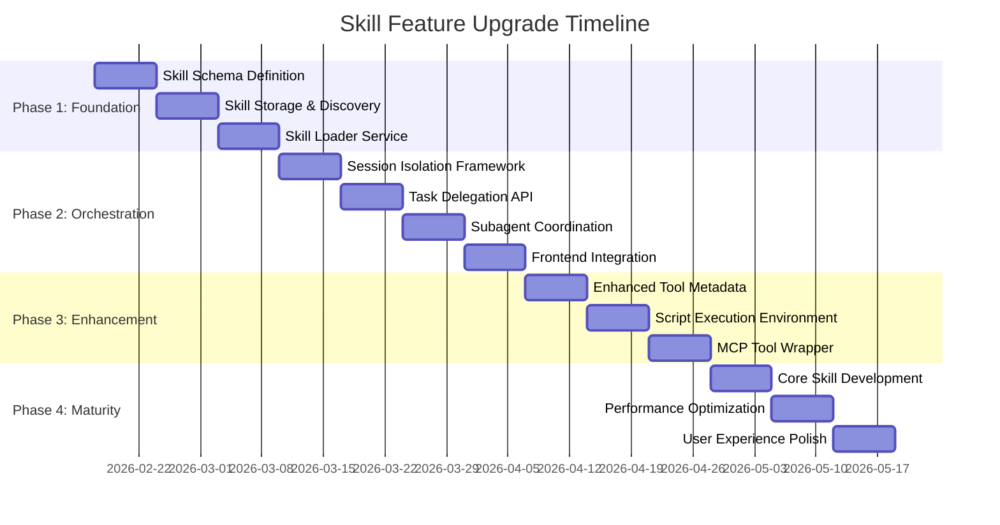

# Skill Feature Upgrade Roadmap

*Generated on February 14, 2026*  
*Version: 1.0.0*

## Executive Summary

This document outlines a comprehensive upgrade plan to implement a **skill-based architecture** in the Yue platform. Building upon the existing MCP tool integration and agent configuration system, this roadmap proposes transforming the platform from a "tool-equipped chatbot" into a **true multi-agent platform** with reusable skill modules, hierarchical agent orchestration, and deterministic script execution.

The upgrade will enable **progressive disclosure** of expertise, **coordinator-subagent delegation**, and **skill-based tool grouping**, resulting in 60-80% token savings, improved error containment, and simplified agent configuration.

## Vision & Goals

### Vision
Transform Yue into a modular AI engineering platform where:
- **Skills** encapsulate reusable expertise (frontend, database, API integration)
- **Agents** assemble skills dynamically based on task requirements  
- **Users** configure agents through skill selection rather than manual tool assignment
- **Complex tasks** decompose automatically via coordinator-subagent orchestration

### Primary Goals
1. **Context Efficiency**: Reduce token usage by 60-80% through progressive disclosure
2. **Configuration Simplicity**: Cut agent setup time by 80% via skill-based assembly
3. **Reliability Improvement**: Move 40% of complex operations from LLM generation to deterministic scripts
4. **Scalability**: Enable addition of new expertise via skill folders, not code changes

### Success Metrics
- Token usage per conversation (target: 60% reduction)
- Agent configuration time (target: 80% reduction)
- Task success rate for complex multi-step problems (target: 95%)
- Number of reusable skills in library (target: 10+ core skills)

## Core Principles (from Skill-Creator)

The implementation will follow established skill design principles:

### 1. Progressive Disclosure
Skills use a three-level loading system to manage context efficiently:
- **Level 1: Metadata** (name + description) - Always in context (~100 words)
- **Level 2: SKILL.md body** - When skill triggers (<5k words)
- **Level 3: Bundled resources** - As needed by Claude (scripts, references, assets)

### 2. Concise is Key
- Only add context Claude doesn't already have
- Challenge each piece of information: "Does Claude really need this explanation?"
- Prefer concise examples over verbose explanations

### 3. Appropriate Degrees of Freedom
- **High freedom**: Text-based instructions for multiple valid approaches
- **Medium freedom**: Pseudocode or scripts with parameters for preferred patterns
- **Low freedom**: Specific scripts with few parameters for fragile operations

### 4. Skill Anatomy
```
skill-name/
├── SKILL.md (required)
│   ├── YAML frontmatter metadata (required)
│   └── Markdown instructions (required)
└── Bundled Resources (optional)
    ├── scripts/          - Executable code (Python/Bash/etc.)
    ├── references/       - Documentation loaded as needed
    └── assets/           - Files used in output (templates, icons, etc.)
```

## Architecture Overview

### Current Architecture (Baseline)
```
User → Agent → LLM → [Authorized Tools]
```

### Target Architecture (Skill-Enabled)
```
User → Coordinator → Skill Selection
                     ↓
              [Subagent Pool]
              /     |     \
    Skill 1   Skill 2   Skill 3
    (Frontend) (Database) (API)
```

### Key Architectural Components

| Component | Purpose | Integration Point |
|-----------|---------|-------------------|
| **Skill Registry** | Discover, validate, load skills | New service at `/api/skills` |
| **Skill Loader** | Progressive disclosure management | Extends MCP manager |
| **Coordinator Engine** | Task decomposition & delegation | New `/api/agents/{id}/delegate` endpoint |
| **Subagent Runtime** | Isolated skill execution | Separate `pydantic-ai` contexts |
| **Script Execution** | Deterministic operation execution | Sandboxed environment with MCP wrapper |

## Implementation Phases

### Phase 1: Foundation - Skill Module System (3 weeks)

**Timeline**: Weeks 1-3  
**Priority**: High (Foundation for all subsequent work)

#### Milestones
1. **Skill Schema Definition** (Week 1)
   - Pydantic models: `SkillDefinition`, `SkillScript`, `SkillReference`
   - Validation logic for skill structure and metadata
   - Migration path for existing built-in agents

2. **Skill Storage & Discovery** (Week 2)
   - Filesystem-based skill storage at `/skills/` directory
   - Skill registry service with versioning support
   - Skill validation and integrity checks
   - Backward compatibility layer

3. **Skill Loader Service** (Week 3)
   - Progressive disclosure implementation
   - Context-aware skill loading (metadata → body → resources)
   - Integration with existing agent configuration
   - Performance optimization (caching, lazy loading)

#### Deliverables
1. `/backend/app/services/skill_registry.py`
2. `/backend/app/models/skill.py` (Pydantic models)
3. `/skills/` directory structure
4. `/backend/app/api/skills.py` (REST API)
5. Updated `agent_store.py` for skill integration

#### Dependencies
- No external dependencies
- Builds on existing MCP infrastructure
- Requires frontend team coordination for UI changes

### Phase 2: Orchestration - Coordinator-Subagent Pattern (4 weeks)

**Timeline**: Weeks 4-7  
**Priority**: High (Enables complex task handling)

#### Milestones
1. **Session Isolation Framework** (Week 4)
   - Separate `pydantic-ai` runtime contexts
   - Subagent lifecycle management (create, execute, cleanup)
   - Resource limits and timeout handling

2. **Task Delegation API** (Week 5)
   - `POST /api/agents/{id}/delegate` endpoint
   - Task description parsing and skill matching
   - Result aggregation and error handling
   - Progress tracking via SSE events

3. **Subagent Coordination** (Week 6)
   - Parallel execution support
   - Dependency resolution between subagents
   - Result synthesis and conflict resolution
   - Audit logging for compliance

4. **Frontend Integration** (Week 7)
   - Real-time subagent status visualization
   - Task decomposition UI
   - Result aggregation display
   - Error handling and recovery UI

#### Deliverables
1. `/backend/app/services/subagent_runner.py`
2. `/backend/app/api/delegation.py`
3. Updated `agents.py` with delegation endpoints
4. Frontend components: `SubagentMonitor`, `TaskDecomposer`
5. SSE event stream for subagent progress

#### Dependencies
- Phase 1 completion (skill registry)
- Frontend team availability for UI work
- Testing infrastructure for parallel execution

### Phase 3: Enhancement - Tool Discovery & Script Integration (3 weeks)

**Timeline**: Weeks 8-10  
**Priority**: Medium (Improves usability and reliability)

#### Milestones
1. **Enhanced Tool Metadata** (Week 8)
   - Extend MCP tool schema with skill categorization
   - Risk level annotation (read/write/dangerous)
   - Tool grouping by skill domain
   - Semantic search capabilities

2. **Script Execution Environment** (Week 9)
   - Secure sandbox for skill script execution
   - Parameter validation and schema enforcement
   - Resource limits and security controls
   - Audit logging for compliance

3. **MCP Tool Wrapper** (Week 10)
   - Expose skill scripts as MCP tools
   - Dynamic tool registration/unregistration
   - Integration with existing tool authorization
   - Performance monitoring and optimization

#### Deliverables
1. Enhanced `mcp/manager.py` with skill categorization
2. `/backend/app/services/script_runner.py`
3. MCP server for skill script execution
4. Updated UI for skill-based tool filtering
5. Security audit report for script execution

#### Dependencies
- Phase 1 completion (skill definitions)
- Security team review for sandbox implementation
- Performance testing infrastructure

### Phase 4: Maturity - Core Skill Library & Optimization (3 weeks)

**Timeline**: Weeks 11-13  
**Priority**: Medium (Completes the ecosystem)

#### Milestones
1. **Core Skill Development** (Week 11)
   - Frontend Expert skill (React, Tailwind, component optimization)
   - Database Analyst skill (SQL optimization, schema design)
   - API Integrator skill (OpenAPI validation, REST patterns)
   - Documentation Specialist skill (Markdown, technical writing)

2. **Performance Optimization** (Week 12)
   - Skill loading performance (caching, preloading)
   - Context switching optimization
   - Memory management for subagents
   - Token usage analytics and optimization

3. **User Experience Polish** (Week 13)
   - Skill marketplace UI (browse, install, update)
   - Skill configuration wizards
   - Template-based agent creation
   - Usage analytics and recommendations

#### Deliverables
1. 4+ production-ready skills in `/skills/` directory
2. Performance optimization patches
3. Enhanced skill management UI
4. Usage analytics dashboard
5. Documentation and training materials

#### Dependencies
- All previous phases complete
- Domain experts for skill content
- User testing for skill effectiveness

## Technical Specifications

### 1. Skill Definition Schema

```python
class SkillDefinition(BaseModel):
    id: str = Field(default_factory=lambda: str(uuid.uuid4()))
    name: str
    description: str  # Used for skill triggering
    version: str = "1.0.0"
    
    # Progressive disclosure levels
    metadata: SkillMetadata  # Always loaded
    body_md: Optional[str] = None  # SKILL.md content
    resources: SkillResources = Field(default_factory=SkillResources)
    
    # Integration points
    system_prompt_templates: Dict[str, str] = Field(default_factory=dict)
    required_tools: List[str] = Field(default_factory=list)
    optional_tools: List[str] = Field(default_factory=list)
    compatible_agents: List[str] = Field(default_factory=list)
    
    # Execution parameters
    default_temperature: float = 0.7
    default_max_tokens: int = 4000
    requires_isolation: bool = True
    
    created_at: datetime = Field(default_factory=datetime.now)
    updated_at: datetime = Field(default_factory=datetime.now)
```

### 2. Skill Storage Structure

```
skills/
├── .registry.json                    # Central registry index
├── frontend-expert/                  # Skill directory
│   ├── SKILL.md                     # Required: metadata + instructions
│   ├── skill.json                   # Skill definition (parsed from SKILL.md frontmatter)
│   ├── scripts/                     # Executable code
│   │   ├── optimize_react.py
│   │   └── lint_css.sh
│   ├── references/                  # Documentation
│   │   ├── tailwind_cheatsheet.md
│   │   └── react_patterns.md
│   └── assets/                      # Output templates
│       ├── component_template.tsx
│       └── style_template.css
├── database-analyst/
│   ├── SKILL.md
│   └── scripts/query_optimizer.py
└── api-integrator/
    ├── SKILL.md
    └── scripts/openapi_validator.py
```

### 3. Progressive Disclosure Implementation

```python
class SkillLoader:
    async def load_for_agent(self, agent_id: str, skill_id: str, level: DisclosureLevel):
        """Load skill content based on disclosure level"""
        skill = await self.registry.get_skill(skill_id)
        
        if level == DisclosureLevel.METADATA_ONLY:
            return skill.metadata
        
        if level == DisclosureLevel.BODY:
            return {
                "metadata": skill.metadata,
                "body": skill.body_md
            }
        
        if level == DisclosureLevel.FULL:
            return {
                "metadata": skill.metadata,
                "body": skill.body_md,
                "scripts": await self.load_scripts(skill),
                "references": await self.load_references(skill)
            }
```

### 4. Subagent Execution Model

```python
class SubagentRunner:
    async def execute_task(self, skill_id: str, task_description: str, parent_context: Dict):
        """Execute task in isolated subagent"""
        # 1. Create isolated runtime
        runtime = await self.create_isolated_runtime()
        
        # 2. Load skill with appropriate disclosure level
        skill_content = await self.skill_loader.load_for_skill(
            skill_id, 
            level=DisclosureLevel.BODY
        )
        
        # 3. Configure subagent with skill context
        subagent = Agent(
            system_prompt=skill_content["system_prompt"],
            tools=skill_content["required_tools"],
            temperature=skill_content["default_temperature"]
        )
        
        # 4. Execute task
        result = await subagent.run(task_description)
        
        # 5. Cleanup and return
        await runtime.cleanup()
        return {
            "success": True,
            "result": result.content,
            "tokens_used": result.usage.total_tokens,
            "execution_time": result.execution_time
        }
```

## Integration Points with Existing System

### 1. MCP Manager Integration
```python
# Extend MCP manager to support skill-based tool grouping
class EnhancedMcpManager(McpManager):
    async def get_tools_by_skill(self, skill_id: str) -> List[Dict]:
        """Return tools categorized under specific skill"""
        skill = await self.skill_registry.get_skill(skill_id)
        all_tools = await self.get_available_tools()
        
        return [
            tool for tool in all_tools
            if tool.get("skill") == skill_id or 
               tool["name"] in skill.required_tools
        ]
```

### 2. Agent Store Integration
```python
# Update agent configuration to support skills
class EnhancedAgentConfig(AgentConfig):
    enabled_skills: List[str] = Field(default_factory=list)
    skill_overrides: Dict[str, Dict[str, Any]] = Field(default_factory=dict)
    
    def get_effective_tools(self) -> List[str]:
        """Combine directly enabled tools with skill-required tools"""
        tools = set(self.enabled_tools)
        
        for skill_id in self.enabled_skills:
            skill = self.skill_registry.get_skill(skill_id)
            tools.update(skill.required_tools)
            
        return list(tools)
```

### 3. Frontend Integration Points
- **Agents page**: Add "Skills" tab for skill management
- **Agent creation/editing**: Skill selection interface
- **Chat interface**: Subagent activity visualization
- **Tools page**: Skill-based tool filtering

## Risk Assessment & Mitigation

| Risk | Probability | Impact | Mitigation Strategy |
|------|------------|--------|---------------------|
| **Skill context bloat** | Medium | High | Progressive disclosure implementation; token budgeting |
| **Subagent resource leak** | Low | High | Resource limits; automatic cleanup; monitoring |
| **Script execution security** | Medium | Critical | Sandboxed execution; parameter validation; audit logging |
| **Performance degradation** | Medium | Medium | Caching; lazy loading; performance monitoring |
| **User adoption resistance** | Low | Medium | Gradual rollout; training; template-based setup |

### Security Considerations
1. **Script Sandboxing**: All skill scripts execute in Docker containers or restricted environments
2. **Parameter Validation**: Strict schema validation for all script parameters
3. **Access Control**: Skills inherit agent authorization; no privilege escalation
4. **Audit Trail**: Complete logging of all skill executions and tool calls
5. **Resource Limits**: CPU, memory, and time limits for all subagents

## Success Metrics & Monitoring

### Quantitative Metrics
1. **Token Efficiency**: Average tokens per conversation (target: 60% reduction)
2. **Configuration Time**: Time to create new agent (target: 80% reduction)
3. **Task Success Rate**: Complex task completion (target: 95% success)
4. **Skill Reuse**: Average skills per agent (target: 2.5+)
5. **Performance**: Subagent startup time < 500ms

### Qualitative Metrics
1. **User Satisfaction**: Survey scores for agent configuration experience
2. **Skill Effectiveness**: User ratings for skill performance
3. **Error Reduction**: Reduction in manual intervention for complex tasks
4. **Adoption Rate**: Percentage of agents using skills

### Monitoring Implementation
```python
# Skill usage analytics
class SkillAnalytics:
    async def track_skill_usage(self, skill_id: str, metrics: Dict):
        await self.db.execute("""
            INSERT INTO skill_usage 
            (skill_id, tokens_saved, execution_time, success)
            VALUES (?, ?, ?, ?)
        """, ...)
```

## Resource Requirements

### Development Team
- **Backend Engineers**: 2 (3 months)
- **Frontend Engineers**: 1 (2 months)
- **Security Engineer**: 0.5 (1 month for review)
- **QA Engineer**: 1 (2 months)

### Infrastructure
- **Sandbox Environment**: Docker/Kubernetes for script execution
- **Monitoring**: Prometheus/Grafana for performance metrics
- **Storage**: Additional 1GB for skill library
- **Backup**: Regular backups of skill registry

## Timeline Summary



## Next Steps (Immediate)

1. **Week 1-2**: Design review and prototyping
   - Create proof-of-concept for skill loading
   - Validate progressive disclosure approach
   - Security review of sandbox design

2. **Week 3**: Team mobilization
   - Assign development resources
   - Set up development environment
   - Create detailed technical specifications

3. **Week 4**: Development kickoff
   - Begin Phase 1 implementation
   - Set up CI/CD pipeline for skill validation
   - Create initial skill templates

## Appendix

### A. Skill Creation Process (from skill-creator)
1. **Understand** the skill with concrete examples
2. **Plan** reusable skill contents (scripts, references, assets)
3. **Initialize** the skill (run init_skill.py)
4. **Edit** the skill (implement resources and write SKILL.md)
5. **Package** the skill (run package_skill.py)
6. **Iterate** based on real usage

### B. Example Skill: Frontend Expert

**SKILL.md frontmatter**:
```yaml
name: Frontend Expert
description: |
  Specialized in React, TypeScript, Tailwind CSS, and modern frontend development.
  Use when: (1) Building React components, (2) Optimizing frontend performance,
  (3) Implementing responsive designs, (4) Debugging frontend issues,
  (5) Setting up frontend tooling (Vite, ESLint, etc.)
```

**Key scripts**:
- `scripts/optimize_react.py`: Component optimization patterns
- `scripts/lint_css.sh`: CSS quality checks
- `scripts/generate_component.py`: Component template generation

**Key references**:
- `references/tailwind_cheatsheet.md`: Tailwind utility classes
- `references/react_patterns.md`: React best practices
- `references/performance.md`: Frontend optimization techniques

### C. Migration Path for Existing Agents

1. **Built-in Docs Agent** → Convert to skill format
2. **Custom Agents** → Optionally migrate to skill-based configuration
3. **Tool Authorization** → Map existing tool lists to skill requirements
4. **Backward Compatibility** → Maintain support for legacy agent format

### D. References
- [Skill Architecture Analysis Report](file:///Users/gavinzhang/ws-ai-recharge-2026/Yue/docs/Skill_Architecture_Analysis_Report.md)
- [Skill Creator Documentation](file:///Users/gavinzhang/ws-ai-recharge-2026/Yue/.trae/skills/skill-creator/SKILL.md)
- [MCP Integration Code](file:///Users/gavinzhang/ws-ai-recharge-2026/Yue/backend/app/api/mcp.py)
- [Agent Store Implementation](file:///Users/gavinzhang/ws-ai-recharge-2026/Yue/backend/app/services/agent_store.py)