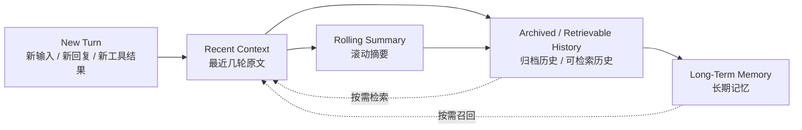
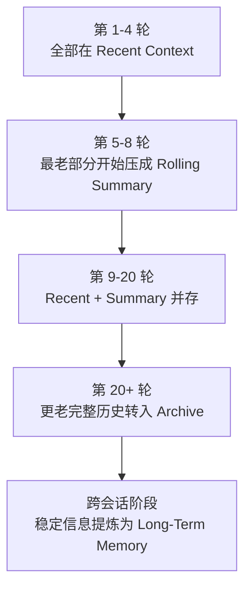
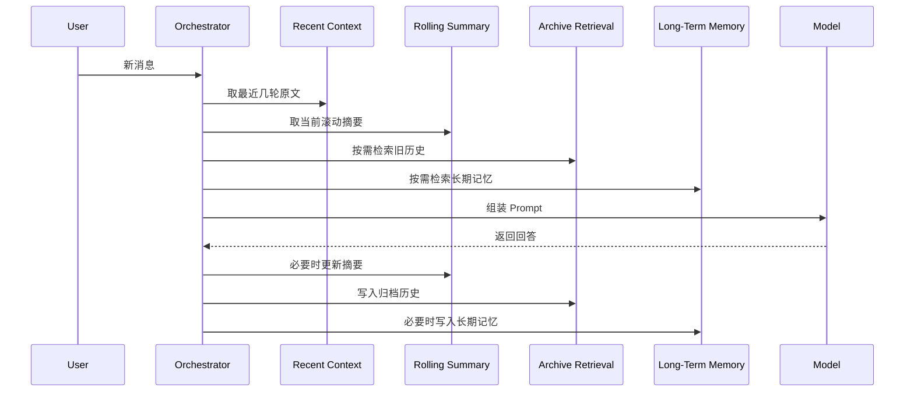

# 四层记忆架构深度讲解

本文系统讲解四层记忆架构中的四个核心概念：

- `Recent context`
- `Rolling summary`
- `Archived / retrievable history`
- `Long-term memory`

目标是帮助对 AI 有初步了解的 IT 经理、BA、架构师和开发人员，在看完文档和图示后，能够理解：

- 为什么长对话不能只靠“保留全部历史”
- 四层之间各自负责什么
- 它们之间如何转换
- 工业界更合理的设计是什么样
- 如果要自己实现，应该如何拆分服务和数据流

---

## 1. 一句话总览

四层记忆架构的核心思想不是“把所有对话都存起来”，而是把不同时间尺度、不同价值密度的信息，放到不同层里管理：

- `最新原文` 进入 `Recent context`
- `较早但仍相关的内容` 进入 `Rolling summary`
- `更老的完整历史` 进入 `Archived / retrievable history`
- `只有稳定且高价值的信息` 才进入 `Long-term memory`

这四层共同作用，目标是同时满足：

- 保持当前回答质量
- 控制 Prompt 成本
- 保持长会话连续性
- 支持跨会话记忆
- 让系统可解释、可治理、可审计

---

## 2. 为什么需要四层

如果一个系统只保留最近几轮对话，会很快丢失背景信息。

如果一个系统把全部聊天记录都塞进 Prompt，会遇到这些问题：

- Token 成本迅速上升
- 模型越来越难聚焦当前问题
- 旧信息与新信息混杂，干扰当前推理
- 工具调用、中间试探、错误说法也会一起留在上下文中
- 跨会话时无法区分“历史聊天”与“稳定记忆”

工业界更合理的方案，通常不是“保留全部”，而是“分层保留”。

---

## 3. 四层的定义

### 3.1 Recent context

`Recent context` 是最近几轮原文消息的窗口。

它的特点：

- 直接进入 Prompt
- 保留原始措辞
- 保存最新数字、修正、限制条件、工具结果
- 通常是最近 `N` 轮，而不是全部历史

它最适合存放：

- 当前问题
- 最近的确认
- 最近的纠正
- 最近的工具输出
- 当前任务还没完成的上下文

它的价值：

- 保证模型看到“最新现场”
- 避免摘要丢失关键细节
- 让模型更准确地承接上一轮

---

### 3.2 Rolling summary

`Rolling summary` 是对较早但仍与当前主题相关内容的压缩表示。

它不是原文，而是结构化或半结构化的“前情提要”。

它的特点：

- 不直接保留全部原句
- 压缩目标、约束、决定、未决问题
- 随会话推进不断更新
- 通常仍与当前主题强相关

它最适合存放：

- 已确认的中间结论
- 当前任务的背景
- 之前讨论过但仍影响当前回答的上下文
- 多轮工具执行后的阶段总结

它的价值：

- 用更少 token 保留更多上下文
- 减少模型对旧历史的逐字依赖
- 为超长会话提供连续性

---

### 3.3 Archived / retrievable history

`Archived / retrievable history` 是完整但不常驻 Prompt 的旧历史。

它的特点：

- 平时不进入 Prompt
- 保留完整原始历史
- 需要时通过检索召回
- 更像会话档案，而不是实时上下文

它最适合存放：

- 更早的对话全文
- 工具调用记录
- 旧阶段的中间讨论
- 不值得进入长期记忆、但未来可能还要查证的内容

它的价值：

- 让系统不必在 Prompt 中常驻大量旧历史
- 保留“可追溯性”和“可回查性”
- 为后续检索提供素材

---

### 3.4 Long-term memory

`Long-term memory` 是从历史中提炼出的稳定、高价值、可复用的信息。

这是四层中最容易被误解的一层。

它不是：

- 所有旧轮次的去处
- 聊天全文备份
- 历史归档层

它真正保存的是：

- 用户稳定偏好
- 长期有效规则
- 跨会话事实
- 长期目标
- 项目级约束

它的特点：

- 条目数量远少于历史总轮次
- 每条都应该有明确价值
- 通常可附带来源、置信度、更新时间
- 需要治理机制，避免错误事实污染

它的价值：

- 支持跨会话连续性
- 让系统具备“长期记住用户”的能力
- 避免重复确认稳定偏好和长期规则

---

## 4. 四层之间的关系

下面这张图展示了四层的总体关系。

理解这张图时要抓住两点：

- `Recent -> Summary -> Archive` 是时间推进下的自然迁移
- `Archive -> Long-term` 不是全量转换，而是筛选式提炼

---

## 5. 真实系统里的转换逻辑

### 5.1 Recent context -> Rolling summary

触发条件通常包括：

- Prompt token 接近预算
- 当前主题已持续较长时间
- 最近窗口外的内容仍然有上下文价值
- 工具调用链已经积累出阶段性结论

转换动作：

- 提取旧轮次中的目标、规则、约束、结论
- 删除冗余寒暄、重复表达、无效试探
- 生成结构化摘要块

不应做的事：

- 把最近仍很关键的轮次过早压缩
- 用摘要替代所有原文

---

### 5.2 Recent / Summary -> Archived history

这不是“摘要”动作，而是“降温”动作。

触发条件通常包括：

- 内容已经不再是当前主题核心
- 不需要常驻 Prompt
- 仍需要保留完整记录以备检索

转换动作：

- 完整消息或事件留在数据库/日志/向量索引中
- 从实时 Prompt 里移除
- 只在检索时重新进入上下文

---

### 5.3 Archived history -> Long-term memory

这是最重要的一步，也是最需要治理的一步。

不是所有历史都能进入长期记忆。只有满足条件的信息才应该进入。

典型条件：

- 信息稳定，不是临时说法
- 信息可复用，未来仍有用
- 信息影响多轮或跨会话行为
- 信息已被确认，不是猜测
- 信息值得单独索引和召回

典型可进入长期记忆的内容：

- 用户偏好：“以后用中文讲解”
- 长期规则：“摘要优先压缩旧轮次，不覆盖最近 4 轮原文”
- 项目约束：“系统必须支持审计日志”
- 长期目标：“要做一个解释 AI 记忆机制的产品演示页”

不适合进入长期记忆的内容：

- 一次性的寒暄
- 瞬时试探
- 临时错误说法
- 无确认的推测
- 工具的原始中间输出

---

## 6. 四层的时间演化示意

下面这张图展示了会话变长时，四层如何演化。

一个更直观的例子：

- 第 `1-4` 轮：全部原文保留
- 第 `5-8` 轮：第 `1-2` 或 `1-4` 轮开始被压成摘要
- 第 `9-20` 轮：系统变成“最近原文 + 滚动摘要”
- 第 `20+` 轮：更老完整历史留在 archive，需要时再检索
- 跨会话时：只有稳定偏好、规则、事实进入长期记忆

---

## 7. 工业界合理做法是什么

工业界更合理的做法通常具备以下共识：

### 7.1 Recent context 不宜太大

常见做法：

- 保留最近 `3-10` 轮原文
- 或按 token 预算保留最近窗口

原因：

- 最近原文最有助于当前推理
- 太大则成本高且噪声多

### 7.2 Summary 应该持续滚动，而不是一次性生成

合理做法：

- 每当对话越过阈值，就增量更新摘要
- 摘要本身也是可演化对象

不合理做法：

- 每轮重新总结全部历史
- 把摘要写成一大段难以维护的自然语言

### 7.3 Archive 应与 Long-term 分开

这是工业实现中很关键的边界。

原因：

- Archive 负责“可追溯”
- Long-term 负责“可复用”

如果混在一起，最终会造成：

- 长期记忆污染
- 检索结果噪声大
- 跨会话行为不稳定

### 7.4 Long-term memory 需要治理

合理做法：

- 写入前做筛选
- 记录来源
- 可更新、可删除
- 尽量有置信度或确认机制

不合理做法：

- 看到旧内容就写入长期记忆
- 不区分稳定事实和临时对话

---

## 8. 推荐的实现策略

### 8.1 数据层拆分

建议至少拆成下面几类存储：

- `messages`
  - 原始对话消息
- `session_summaries`
  - 会话级滚动摘要
- `archived_events` 或可检索消息索引
  - 更老历史的检索层
- `long_term_memories`
  - 稳定偏好、规则、事实

这样做的好处是职责清晰，后续更容易扩展。

---

### 8.2 服务层拆分

建议至少拆成下面几类服务：

- `context window service`
  - 负责 recent context 选择
- `summary service`
  - 负责 rolling summary 生成与更新
- `history retrieval service`
  - 负责 archive 检索
- `memory governance service`
  - 负责长期记忆写入、更新、去重、删除

这样业务层不会直接耦合到底层记忆引擎。

---

### 8.3 触发策略

建议组合使用以下触发器：

- `token budget trigger`
  - 上下文接近预算时触发摘要
- `semantic boundary trigger`
  - 一个子主题完成时触发摘要
- `stability trigger`
  - 某信息被多次确认时写入长期记忆
- `retrieval trigger`
  - 当前问题明显依赖旧主题时触发历史检索

---

## 9. 一个完整的运行流程

下面这张图展示一次新消息进入系统后，四层是如何协作的。

---

## 10. 什么时候该写入长期记忆

推荐写入条件：

- 用户明确表达长期偏好
- 某条规则被确认并且未来会复用
- 某个项目事实跨多轮仍反复引用
- 该信息跨会话仍然有意义

不建议写入条件：

- 信息仅对当前一次任务有用
- 用户还没确认
- 只是工具临时输出
- 很容易随时间过期

---

## 11. 常见误区

### 误区 1：摘要就是长期记忆

不对。

- 摘要服务的是当前会话连续性
- 长期记忆服务的是跨会话复用

### 误区 2：旧历史都应该进长期记忆

不对。

- 旧历史主要去 archive
- 长期记忆只保留高价值稳定项

### 误区 3：最近窗口越大越好

不对。

- 窗口过大只会增加噪声和成本
- 正确做法是 recent + summary + retrieval 协同

### 误区 4：长期记忆写入后就一劳永逸

不对。

- 长期记忆也需要更新、替换、删除
- 用户偏好和项目规则会变化

---

## 12. 推荐给管理者和开发者的理解方式

对于 IT 经理和 BA：

- 把四层理解成“不同温度的信息管理”
- 最近的内容最热，直接参与回答
- 旧但相关的内容被压缩
- 更老的内容被归档
- 只有长期有价值的内容才进入长期记忆

对于架构师和开发：

- 把四层理解成“不同生命周期的数据平面”
- Recent 是在线上下文层
- Summary 是压缩层
- Archive 是检索层
- Long-term 是治理后的知识层

---

## 13. 最后总结

一个工业级的长会话管理系统，不应把“聊天历史”当成一个单一对象来处理。

更合理的做法是将其拆成四层：

- `Recent context`：保留最新现场
- `Rolling summary`：压缩仍相关的过去
- `Archived / retrievable history`：保留完整旧历史，按需召回
- `Long-term memory`：只沉淀稳定高价值信息

真正优秀的设计，不是“记住所有东西”，而是：

- 让当前推理看到最有用的信息
- 让旧信息在需要时可追溯
- 让长期高价值信息跨会话复用
- 让整个过程可治理、可解释、可实现

如果要自己实现，这四层最好从一开始就分开建模，而不是后期再把“聊天记录”硬拆成记忆系统。
