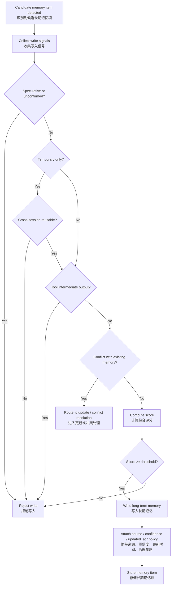

# Long-Term Memory 写入治理专题文档

本文聚焦讲解四层记忆架构中的 `Long-term memory` 层，重点说明：

- 为什么 `Long-term memory` 不能接收所有旧历史
- 为什么只有稳定且高价值的信息才应该进入长期记忆
- 如何把这套逻辑落成写入原则、规则表、伪代码与决策流
- 如何让长期记忆具备可解释、可观测、可治理、可回滚能力

---

## 1. 核心结论

`Long-term memory` 的写入条件，不建议设计成“旧内容都可以进入长期记忆”，也不建议设计成“只要出现过一次就写入”。

更合理的工业实现是：  
只有同时满足**稳定性**、**高价值**、**可复用**、**已确认**等条件的信息，才应进入 `Long-term memory`。

原因是：

- 绝大多数历史内容只是会话过程，不适合跨会话保留
- 很多内容是临时说法、探索过程、工具中间输出或错误假设
- 如果长期记忆写入门槛过低，会快速被噪声污染
- 一旦长期记忆污染，跨会话行为会变得不稳定，甚至持续重复错误
- 长期记忆不是历史归档层，而是治理后的高价值知识层

因此，是否写入 `Long-term memory`，更合理的方式是把它视为一个**治理决策问题**，由多个条件共同决定，而不是简单按轮次、时间或历史位置自动下沉。

---

## 2. Long-term memory 写入条件设计原则

## 2.1 “旧”不是写入理由，稳定和价值才是写入理由

很多系统容易误把长期记忆理解为“更老内容的去处”。  
这是不对的。

旧历史的主要去处通常应该是：

- `Archived / retrievable history`

而不是：

- `Long-term memory`

因为“旧”只代表时间位置，不代表信息质量。  
只有那些已经证明自己在未来仍有价值、且足够稳定的信息，才适合被提炼进长期记忆。

所以更合理的方式是：

- `history_age` 只能作为辅助背景
- 真正决定写入的是稳定性、价值密度、复用潜力、确认程度和治理风险

---

## 2.2 优先围绕“稳定性”与“跨会话复用价值”来判断

长期记忆写入最关键的两个根本维度是：

### A. 信息是否稳定

例如：

- 用户明确表达了长期偏好
- 某条规则已经被确认，不是临时说法
- 某个项目级约束短期内不会变化
- 某个事实已经被反复引用或再次确认

这类场景下，写入的目标是**沉淀稳定项**。

### B. 信息是否具有跨会话复用价值

例如：

- 未来回答中仍会反复用到
- 会影响默认表达方式、推理方式或系统行为
- 会影响多个任务，而不是只影响当前一次对话
- 不写入会导致后续重复确认或重复犯错

这类场景下，写入的目标是**减少重复、提升连续性**。

工业实现里，这两个维度通常是最关键的。

---

## 2.3 长期记忆应服务于“跨会话复用”，而不是“完整保留”

`Long-term memory` 的目的不是保留所有有意义的历史，而是只保留那些会持续影响未来交互的高价值信息，例如：

- 用户稳定偏好
- 长期有效规则
- 跨会话事实
- 项目级约束
- 长期目标
- 沟通风格约定
- 需持续遵守的系统行为规范

不应进入长期记忆的内容通常包括：

- 一次性的寒暄
- 仅当前任务有效的临时要求
- 未确认的推测
- 工具原始中间输出
- 短期会过期的状态
- 临时错误说法
- 细粒度但未来复用价值很低的琐碎细节

所以写入逻辑不仅要判断“能不能写”，还要判断“值不值得长期保留”。

---

## 2.4 长期记忆写入应是筛选式提炼，而不是自动下沉

更合理的做法不是：

- 旧消息自动流入长期记忆
- 摘要结果自动转成长记忆
- 任何高频出现的信息都直接写入

而是：

- 先在历史或摘要中识别候选记忆项
- 再基于规则或评分判断是否满足写入门槛
- 写入时附带来源、时间、置信度、更新策略
- 必要时允许人工确认、系统二次校验或延迟写入

这样有几个好处：

- 减少错误写入
- 降低记忆污染
- 增强可回滚性
- 更适合合规和审计

---

## 2.5 长期记忆写入必须可解释、可观测、可更新、可删除

工业系统里不应该只是默默把一条内容塞进长期记忆。

更好的做法是把写入原因记录下来，例如：

- `stability_score = 0.92`
- `reuse_value_score = 0.88`
- `confirmed_by_user = true`
- `source_turns = [4, 9, 13]`
- `memory_write_score = 9`
- `write_decision = accepted`

这样后续可以：

- 做线上调参
- 分析误写入和漏写入
- 解释为什么某条信息被长期记住
- 支持更新、替换、失效和删除
- 满足治理、审计与合规要求

---

## 3. 组合判断规则表示例

下面这版规则表适合放入工程方案文档中。可以把它理解成一个“长期记忆写入评分器”。

### 3.1 写入信号分类

| 信号类别 | 信号名 | 含义 | 示例 |
|---|---|---|---|
| 稳定性 | `user_explicit_preference` | 用户明确表达长期偏好 | “以后都用中文讲解” |
| 稳定性 | `rule_confirmed` | 某条规则已被确认 | “最近 4 轮原文不能被摘要覆盖” |
| 稳定性 | `fact_reconfirmed` | 同一事实被多次再次确认 | 多轮重复提到同一项目约束 |
| 稳定性 | `project_constraint_stable` | 项目级约束短期稳定 | “系统必须支持审计日志” |
| 复用价值 | `cross_session_reusable` | 未来跨会话仍会用到 | 表达偏好、格式约定、长期目标 |
| 复用价值 | `behavior_affecting` | 会影响系统默认行为 | 默认输出语言、默认结构风格 |
| 复用价值 | `repeat_confirmation_cost_high` | 不写入会导致频繁重复确认 | 每次都要重新说明同一偏好 |
| 确认度 | `confirmed_by_user` | 信息已被用户明确确认 | 明确同意、直接声明 |
| 确认度 | `derived_but_supported` | 虽非逐字声明，但证据充分 | 多轮一致行为可支持该结论 |
| 风险控制 | `temporary_signal` | 信息明显短期有效 | “今天先这样处理” |
| 风险控制 | `speculative_or_unconfirmed` | 内容仍属推测 | “可能后面会改” |
| 风险控制 | `tool_intermediate_output` | 内容只是工具中间产物 | 临时检索结果、草算值 |
| 风险控制 | `sensitive_or_governed` | 信息需额外治理 | 需特殊合规策略的记忆项 |
| 去重更新 | `similar_memory_exists` | 已存在相似长期记忆 | 同一偏好已有旧版本 |
| 去重更新 | `conflicts_with_existing_memory` | 与已有记忆冲突 | 用户改了语言偏好或规则 |

---

### 3.2 推荐评分权重示例

| 信号名 | 权重 | 说明 |
|---|---:|---|
| `user_explicit_preference` | 3 | 很强的正向信号 |
| `rule_confirmed` | 3 | 很强的正向信号 |
| `fact_reconfirmed` | 2 | 强信号 |
| `project_constraint_stable` | 2 | 强信号 |
| `cross_session_reusable` | 3 | 很强的正向信号 |
| `behavior_affecting` | 2 | 强信号 |
| `repeat_confirmation_cost_high` | 2 | 强信号 |
| `confirmed_by_user` | 3 | 很强的正向信号 |
| `derived_but_supported` | 1 | 辅助正向信号 |
| `temporary_signal` | -3 | 很强的负向信号 |
| `speculative_or_unconfirmed` | -3 | 很强的负向信号 |
| `tool_intermediate_output` | -2 | 强负向信号 |
| `sensitive_or_governed` | -1 | 需要附加治理流程 |
| `similar_memory_exists` | -1 | 倾向做更新而不是新增 |
| `conflicts_with_existing_memory` | -2 | 需要先冲突处理 |

---

### 3.3 推荐写入规则

可以设计成两层：

#### 第一层：硬拒绝规则

满足任一条件即可直接拒绝写入：

1. `speculative_or_unconfirmed = true`
2. `temporary_signal = true AND cross_session_reusable = false`
3. `tool_intermediate_output = true`
4. `conflicts_with_existing_memory = true` 且尚未完成冲突处理

#### 第二层：评分写入规则

若未命中硬拒绝，则计算总分：

```text
score =
  3 * user_explicit_preference
+ 3 * rule_confirmed
+ 2 * fact_reconfirmed
+ 2 * project_constraint_stable
+ 3 * cross_session_reusable
+ 2 * behavior_affecting
+ 2 * repeat_confirmation_cost_high
+ 3 * confirmed_by_user
+ 1 * derived_but_supported
- 3 * temporary_signal
- 3 * speculative_or_unconfirmed
- 2 * tool_intermediate_output
- 1 * sensitive_or_governed
- 1 * similar_memory_exists
- 2 * conflicts_with_existing_memory
```

当：

- `score >= 6`：建议写入长期记忆
- `score >= 8`：强烈建议写入长期记忆
- `score < 6`：不写入，保留在摘要或历史层

---

### 3.4 更实用的一版业务规则

#### 规则 A：用户长期偏好触发

当以下组合成立时，建议写入：

- 用户明确表达偏好
- 该偏好未来会持续影响回答行为
- 该偏好不是临时性的

例如：

- “以后都用中文解释”
- “默认给我详细版，不要只给结论”
- “涉及架构方案时先给分层图，再给接口设计”

#### 规则 B：长期规则触发

当以下组合成立时，建议写入：

- 某条规则已明确确认
- 未来多个任务都会复用
- 不写入会导致系统行为不稳定

例如：

- “摘要优先压缩旧轮次，不覆盖最近 4 轮原文”
- “回答技术方案时优先给可落地结构”

#### 规则 C：项目级稳定事实触发

当以下组合成立时，建议写入：

- 事实不是临时状态
- 未来多轮或跨会话仍需要引用
- 已有明确证据支持

例如：

- “系统必须支持审计日志”
- “该项目目标用户是银行内部客服 Agent”

#### 规则 D：拒绝写入触发

当以下任一成立时，不建议写入：

- 只是当前一次任务的临时要求
- 仍属猜测或未确认
- 只是工具临时输出
- 很快会过期
- 与现有长期记忆冲突但尚未解决

---

## 4. 伪代码 / 状态机 / 决策流图

下面给出三种表达方式，分别适合工程实现、架构说明和文档展示。

### 4.1 伪代码版本

```python
def should_write_long_term_memory(candidate) -> dict:
    user_explicit_preference = candidate.user_explicit_preference
    rule_confirmed = candidate.rule_confirmed
    fact_reconfirmed = candidate.fact_reconfirmed_count >= 2
    project_constraint_stable = candidate.project_constraint_stable
    cross_session_reusable = candidate.cross_session_reusable
    behavior_affecting = candidate.behavior_affecting
    repeat_confirmation_cost_high = candidate.repeat_confirmation_cost_high
    confirmed_by_user = candidate.confirmed_by_user
    derived_but_supported = candidate.derived_but_supported
    temporary_signal = candidate.temporary_signal
    speculative_or_unconfirmed = candidate.speculative_or_unconfirmed
    tool_intermediate_output = candidate.tool_intermediate_output
    sensitive_or_governed = candidate.sensitive_or_governed
    similar_memory_exists = candidate.similar_memory_exists
    conflicts_with_existing_memory = candidate.conflicts_with_existing_memory

    reasons = []

    # Hard rejection rules
    if speculative_or_unconfirmed:
        reasons.append("speculative_or_unconfirmed")
        return {
            "should_write": False,
            "mode": "hard_reject",
            "reasons": reasons
        }

    if temporary_signal and not cross_session_reusable:
        reasons.extend(["temporary_signal", "not_cross_session_reusable"])
        return {
            "should_write": False,
            "mode": "hard_reject",
            "reasons": reasons
        }

    if tool_intermediate_output:
        reasons.append("tool_intermediate_output")
        return {
            "should_write": False,
            "mode": "hard_reject",
            "reasons": reasons
        }

    if conflicts_with_existing_memory:
        reasons.append("conflicts_with_existing_memory")
        return {
            "should_write": False,
            "mode": "hard_reject",
            "reasons": reasons
        }

    # Score-based evaluation
    score = 0
    score += 3 if user_explicit_preference else 0
    score += 3 if rule_confirmed else 0
    score += 2 if fact_reconfirmed else 0
    score += 2 if project_constraint_stable else 0
    score += 3 if cross_session_reusable else 0
    score += 2 if behavior_affecting else 0
    score += 2 if repeat_confirmation_cost_high else 0
    score += 3 if confirmed_by_user else 0
    score += 1 if derived_but_supported else 0
    score -= 3 if temporary_signal else 0
    score -= 3 if speculative_or_unconfirmed else 0
    score -= 2 if tool_intermediate_output else 0
    score -= 1 if sensitive_or_governed else 0
    score -= 1 if similar_memory_exists else 0
    score -= 2 if conflicts_with_existing_memory else 0

    if user_explicit_preference:
        reasons.append("user_explicit_preference")
    if rule_confirmed:
        reasons.append("rule_confirmed")
    if fact_reconfirmed:
        reasons.append("fact_reconfirmed")
    if project_constraint_stable:
        reasons.append("project_constraint_stable")
    if cross_session_reusable:
        reasons.append("cross_session_reusable")
    if behavior_affecting:
        reasons.append("behavior_affecting")
    if repeat_confirmation_cost_high:
        reasons.append("repeat_confirmation_cost_high")
    if confirmed_by_user:
        reasons.append("confirmed_by_user")
    if derived_but_supported:
        reasons.append("derived_but_supported")
    if temporary_signal:
        reasons.append("temporary_signal")
    if sensitive_or_governed:
        reasons.append("sensitive_or_governed")
    if similar_memory_exists:
        reasons.append("similar_memory_exists")

    return {
        "should_write": score >= 6,
        "mode": "score_accept" if score >= 6 else "no_write",
        "score": score,
        "reasons": reasons
    }
```

---

### 4.2 状态机版本

#### 状态定义

- `NoCandidate`
  - 尚未识别出可考虑的长期记忆候选项
- `CandidateDetected`
  - 已从历史、摘要或当前轮识别出候选项
- `UnderEvaluation`
  - 正在评估稳定性、价值、确认度和冲突风险
- `ApprovedToWrite`
  - 已满足写入条件，等待落库
- `Written`
  - 已写入长期记忆
- `Rejected`
  - 不满足写入条件，保留在历史或摘要层
- `NeedsUpdate`
  - 与已有长期记忆相似或冲突，需要更新而不是新增
- `Invalidated`
  - 原有长期记忆已过期、被替换或应删除

#### 状态转移逻辑

```text
NoCandidate
  -> CandidateDetected
     当系统识别到可能具有长期价值的信息时

CandidateDetected
  -> UnderEvaluation
     当进入写入治理流程时

UnderEvaluation
  -> ApprovedToWrite
     当稳定性、复用价值、确认度满足阈值，且无硬拒绝条件时

UnderEvaluation
  -> Rejected
     当内容临时、未确认、无复用价值或只是工具中间输出时

UnderEvaluation
  -> NeedsUpdate
     当与已有长期记忆相似或冲突时

ApprovedToWrite
  -> Written
     当 memory governance service 完成写入后

NeedsUpdate
  -> Written
     当已有记忆被更新、替换或合并后

Written
  -> Invalidated
     当后续确认该记忆失效、被覆盖或应删除时
```

---

### 4.3 Mermaid 决策流图



---

## 5. 建议输出的结构化写入决策结果

为了让这个机制可治理，建议每次长期记忆写入决策都输出一份结构化结果，例如：

```json
{
  "should_write_memory": true,
  "decision_mode": "score_accept",
  "score": 9,
  "reasons": [
    "user_explicit_preference",
    "cross_session_reusable",
    "confirmed_by_user",
    "behavior_affecting"
  ],
  "memory_type": "user_preference",
  "memory_key": "response_language",
  "memory_value": "zh-CN",
  "source_turns": [6, 12],
  "confidence": 0.94,
  "write_policy": {
    "dedupe_strategy": "upsert_by_key",
    "conflict_strategy": "replace_old_value",
    "ttl": null
  }
}
```

这能支撑：

- 线上调试
- A/B test
- 记忆解释
- 日志审计
- 记忆回放
- 更新、替换、失效和删除策略

---

## 6. 推荐写进方案文档的结论段

`Long-term memory` 不应作为旧历史的自动去向，而应作为稳定、高价值、可复用信息的治理后沉淀层。更合理的工程实现是：将稳定性、跨会话复用价值、确认程度、行为影响范围、冲突风险等信号统一纳入写入决策机制，通过硬拒绝规则与评分机制结合，动态决定是否将候选项写入长期记忆。这样既能避免长期记忆被临时信息和噪声污染，也能为跨会话连续性提供高质量支撑，从而在记忆能力、系统稳定性和治理可控性之间取得更好的平衡。

---

## 7. 实施建议

如果后续要继续扩展这个专题，建议下一步继续补充：

1. `long_term_memories` 的数据结构设计  
2. `memory governance service` 的 API 草案  
3. 长期记忆的去重、冲突处理与版本管理机制  
4. 长期记忆的失效、替换、删除策略  
5. 与 `Rolling summary / Archive / Recent context` 的联动机制  
6. 多租户、多角色、多会话场景下的记忆隔离策略

