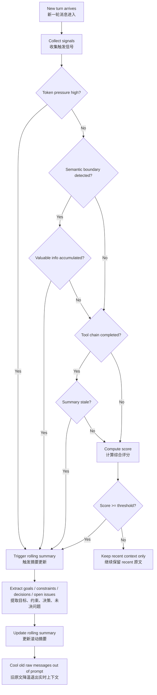

# Rolling Summary 触发机制专题文档

本文聚焦讲解四层记忆架构中的 `Rolling summary` 层，重点说明：

- 为什么 `Rolling summary` 不应按固定轮次生成
- 更合理的工业实现应如何基于多个条件组合判断
- 如何把这套逻辑落成规则表、伪代码与决策流
- 如何让摘要机制具备可解释、可观测、可治理能力

---

## 1. 核心结论

`Rolling summary` 的生成条件，不建议设计成“到第 N 轮就总结一次”这种单一规则，而更适合做成**多信号组合判断**。

原因是：

- 不同会话长度差异很大
- 不同任务复杂度差异很大
- 工具调用密度并不稳定
- 某些会话虽然轮次少，但信息密度极高
- 某些会话虽然轮次多，但大部分只是轻量澄清

因此，是否生成或更新 `Rolling summary`，更合理的方式是把它视为一个**动态决策问题**，由多个条件共同决定，而不是依赖固定轮次。

---

## 2. Rolling summary 触发条件设计原则

## 2.1 轮次只能作为弱信号，不能作为唯一信号

轮次数量可以作为参考，但不应单独决定是否摘要。

原因很简单：

- 有些会话 4 轮就已经积累了大量约束和工具结果
- 有些会话 12 轮仍然只是轻量澄清，不值得摘要

所以更合理的方式是：

- `turn_count` 作为辅助指标
- 与 token 压力、语义边界、信息密度等一起参与判断

---

## 2.2 优先围绕“上下文压力”与“语义阶段完成”来触发

触发 summary 最常见的两个根本原因是：

### A. 上下文压力正在增大

例如：

- prompt token 接近预算
- recent context 持续膨胀
- 工具输出太长
- 模型回答空间被压缩

这类场景下，摘要的目标是**减负**。

### B. 当前阶段已经形成可沉淀结果

例如：

- 某个子问题已经讨论清楚
- 某轮工具调用链已经结束
- 一组约束、决策、结论已经稳定
- 对话主题开始切换

这类场景下，摘要的目标是**固化阶段成果**。

工业实现里，这两类信号通常是最关键的。

---

## 2.3 摘要应服务于“保留有效信息”，而不是机械压缩

`Rolling summary` 的目的不是简单缩短文本，而是从旧内容中提炼对后续仍有价值的信息，例如：

- 当前任务目标
- 已确认约束
- 已作出的设计决策
- 关键中间结论
- 未决问题
- 工具调用得到的稳定结果

不应进入 summary 的内容通常包括：

- 寒暄
- 重复表达
- 探索性但未确认的假设
- 噪声型工具输出
- 已失效的临时说法

所以触发逻辑不仅要判断“该不该总结”，还要隐含判断“有没有值得总结的东西”。

---

## 2.4 摘要更新应是增量式，而不是每次全量重写

更合理的做法不是：

- 每轮重新总结全部历史

而是：

- 当触发条件成立时，仅把“最近从未被沉淀过的一段内容”压入 summary
- 或者对已有 summary 做局部更新

这样有几个好处：

- 成本更低
- 一致性更强
- 更容易追踪摘要是如何演化的
- 更适合审计与回滚

---

## 2.5 摘要触发应可解释、可观测、可调参

工业系统里不应该只输出一个黑盒结果：“本轮触发了摘要”。

更好的做法是把触发原因记录下来，例如：

- `token_pressure_high = true`
- `semantic_boundary_detected = true`
- `new_constraints_count = 4`
- `tool_chain_completed = true`
- `summary_update_score = 8`

这样后续可以：

- 做线上调参
- 分析误触发和漏触发
- 解释系统行为
- 支持治理与审计

---

## 3. 组合判断规则表示例

下面这版规则表适合放入工程方案文档中。可以把它理解成一个“摘要触发评分器”。

### 3.1 触发信号分类

| 信号类别 | 信号名 | 含义 | 示例 |
|---|---|---|---|
| 上下文压力 | `token_pressure_high` | prompt 已接近预算 | 当前上下文已占预算 80% 以上 |
| 上下文压力 | `recent_window_too_large` | recent context 原文窗口过大 | 最近原文条数或 token 超阈值 |
| 语义阶段 | `semantic_boundary_detected` | 子主题告一段落 | “已经确定方案了，下面讨论实现” |
| 语义阶段 | `topic_shift_detected` | 对话明显切换主题 | 从需求分析切到数据库设计 |
| 工具链阶段 | `tool_chain_completed` | 一轮工具执行链已完成 | 检索→比对→结论输出结束 |
| 信息密度 | `valuable_info_accumulated` | 已形成较多高价值信息 | 新增多个约束、结论、待办 |
| 信息密度 | `new_constraints_detected` | 出现新的约束条件 | “必须支持审计日志”“必须可回滚” |
| 冗余噪声 | `redundancy_high` | 近几轮重复表达较多 | 多轮重复确认同一要求 |
| 冗余噪声 | `low_value_chatter_high` | 低价值对话占比高 | 寒暄、重复表述、轻量试探 |
| 摘要状态 | `summary_stale` | 当前摘要已明显滞后 | 最近重要信息尚未沉淀 |
| 会话规模 | `turn_count_large` | 会话已明显变长 | 仅作为弱信号，不单独触发 |

---

### 3.2 推荐评分权重示例

| 信号名 | 权重 | 说明 |
|---|---:|---|
| `token_pressure_high` | 3 | 很强的触发因素 |
| `recent_window_too_large` | 2 | 强信号 |
| `semantic_boundary_detected` | 3 | 很强的触发因素 |
| `topic_shift_detected` | 2 | 强信号 |
| `tool_chain_completed` | 2 | 强信号 |
| `valuable_info_accumulated` | 3 | 很强的触发因素 |
| `new_constraints_detected` | 2 | 强信号 |
| `redundancy_high` | 1 | 辅助信号 |
| `low_value_chatter_high` | 1 | 辅助信号 |
| `summary_stale` | 2 | 强信号 |
| `turn_count_large` | 1 | 弱信号 |

---

### 3.3 推荐触发规则

可以设计成两层：

#### 第一层：硬触发规则

满足任一条件即可直接触发：

1. `token_pressure_high = true`
2. `semantic_boundary_detected = true AND valuable_info_accumulated = true`
3. `tool_chain_completed = true AND summary_stale = true`

#### 第二层：评分触发规则

若未命中硬触发，则计算总分：

```text
score =
  3 * token_pressure_high
+ 2 * recent_window_too_large
+ 3 * semantic_boundary_detected
+ 2 * topic_shift_detected
+ 2 * tool_chain_completed
+ 3 * valuable_info_accumulated
+ 2 * new_constraints_detected
+ 1 * redundancy_high
+ 1 * low_value_chatter_high
+ 2 * summary_stale
+ 1 * turn_count_large
```

当：

- `score >= 6`：建议更新 summary
- `score >= 8`：强烈建议更新 summary
- `score < 6`：继续保留 recent 原文为主

---

### 3.4 更实用的一版业务规则

#### 规则 A：成本压力触发

当以下任一成立时触发摘要：

- recent context token 超过预算阈值
- 预计本轮回答空间不足
- 最近工具输出过长，继续保留原文会明显影响主任务

#### 规则 B：阶段结束触发

当以下组合成立时触发摘要：

- 子主题结束
- 或工具链结束
- 且已经产生值得保留的结论 / 约束 / 决策

#### 规则 C：摘要滞后触发

当以下组合成立时触发摘要：

- 当前已有 summary
- 但最近新增的重要上下文尚未沉淀
- 且这些内容未来大概率还会影响后续回答

#### 规则 D：降噪触发

当以下组合成立时触发摘要：

- recent 中存在较多重复、寒暄、低价值内容
- 但其中夹杂了少量关键结论
- 适合通过摘要做一次“提纯”

---

## 4. 伪代码 / 状态机 / 决策流图

下面给出三种表达方式，分别适合工程实现、架构说明和文档展示。

### 4.1 伪代码版本

```python
def should_update_rolling_summary(context_state) -> dict:
    token_pressure_high = context_state.prompt_token_ratio >= 0.80
    recent_window_too_large = context_state.recent_token_count >= context_state.recent_token_limit
    semantic_boundary_detected = context_state.semantic_boundary_detected
    topic_shift_detected = context_state.topic_shift_detected
    tool_chain_completed = context_state.tool_chain_completed
    valuable_info_accumulated = context_state.valuable_info_count >= 3
    new_constraints_detected = context_state.new_constraints_count >= 2
    redundancy_high = context_state.redundancy_score >= 0.70
    low_value_chatter_high = context_state.low_value_ratio >= 0.50
    summary_stale = context_state.summary_stale
    turn_count_large = context_state.turn_count >= 8

    reasons = []

    # Hard triggers
    if token_pressure_high:
        reasons.append("token_pressure_high")
        return {
            "should_update": True,
            "mode": "hard_trigger",
            "reasons": reasons
        }

    if semantic_boundary_detected and valuable_info_accumulated:
        reasons.extend(["semantic_boundary_detected", "valuable_info_accumulated"])
        return {
            "should_update": True,
            "mode": "hard_trigger",
            "reasons": reasons
        }

    if tool_chain_completed and summary_stale:
        reasons.extend(["tool_chain_completed", "summary_stale"])
        return {
            "should_update": True,
            "mode": "hard_trigger",
            "reasons": reasons
        }

    # Score-based triggers
    score = 0
    score += 3 if token_pressure_high else 0
    score += 2 if recent_window_too_large else 0
    score += 3 if semantic_boundary_detected else 0
    score += 2 if topic_shift_detected else 0
    score += 2 if tool_chain_completed else 0
    score += 3 if valuable_info_accumulated else 0
    score += 2 if new_constraints_detected else 0
    score += 1 if redundancy_high else 0
    score += 1 if low_value_chatter_high else 0
    score += 2 if summary_stale else 0
    score += 1 if turn_count_large else 0

    if recent_window_too_large:
        reasons.append("recent_window_too_large")
    if semantic_boundary_detected:
        reasons.append("semantic_boundary_detected")
    if topic_shift_detected:
        reasons.append("topic_shift_detected")
    if tool_chain_completed:
        reasons.append("tool_chain_completed")
    if valuable_info_accumulated:
        reasons.append("valuable_info_accumulated")
    if new_constraints_detected:
        reasons.append("new_constraints_detected")
    if redundancy_high:
        reasons.append("redundancy_high")
    if low_value_chatter_high:
        reasons.append("low_value_chatter_high")
    if summary_stale:
        reasons.append("summary_stale")
    if turn_count_large:
        reasons.append("turn_count_large")

    return {
        "should_update": score >= 6,
        "mode": "score_trigger" if score >= 6 else "no_trigger",
        "score": score,
        "reasons": reasons
    }
```

---

### 4.2 状态机版本

#### 状态定义

- `Fresh`
  - 最近上下文仍然清晰，暂不需要摘要
- `Growing`
  - 上下文持续增长，开始积累压力
- `ReadyToSummarize`
  - 已达到摘要条件，等待执行摘要
- `Summarized`
  - 摘要刚完成，recent 被部分释放
- `StaleSummary`
  - 摘要存在但已滞后，需要补充更新

#### 状态转移逻辑

```text
Fresh
  -> Growing
     当 recent context 持续变长或新信息持续增加时

Growing
  -> ReadyToSummarize
     当 token 压力高
     或语义阶段结束且信息已沉淀
     或工具链结束且摘要滞后

ReadyToSummarize
  -> Summarized
     当 summary service 成功生成/更新摘要后

Summarized
  -> Growing
     当新的原文上下文继续累积时

Summarized
  -> StaleSummary
     当 recent 中已出现多轮重要新信息，但摘要尚未同步时

StaleSummary
  -> ReadyToSummarize
     当补充摘要条件达到阈值时
```

---

### 4.3 Mermaid 决策流图



---

## 5. 建议输出的结构化决策结果

为了让这个机制可治理，建议每次摘要决策都输出一份结构化结果，例如：

```json
{
  "should_update_summary": true,
  "trigger_mode": "hard_trigger",
  "score": 8,
  "reasons": [
    "semantic_boundary_detected",
    "valuable_info_accumulated",
    "summary_stale"
  ],
  "summary_scope": {
    "from_turn": 5,
    "to_turn": 11
  },
  "expected_gain": {
    "tokens_saved": 1800,
    "information_density_improved": true
  }
}
```

这能支撑：

- 线上调试
- A/B test
- 日志审计
- 策略回放
- 为什么这轮触发摘要的解释

---

## 6. 推荐写进方案文档的结论段

`Rolling summary` 的生成不应采用固定轮次触发，而应基于多条件组合判断。更合理的工程实现是：将 token 压力、语义阶段边界、工具链完成情况、信息密度、摘要滞后程度等信号统一纳入决策机制，通过硬触发规则与评分机制结合，动态决定是否生成或更新摘要。这样既能避免过早压缩关键原文，也能在长对话中及时沉淀有效上下文，从而在回答质量、上下文成本和系统可治理性之间取得更好的平衡。

---

## 7. 实施建议

如果后续要继续扩展这个专题，建议下一步继续补充：

1. `Rolling summary` 的数据结构设计  
2. `summary service` 的 API 草案  
3. 与 `Recent context / Archive / Long-term memory` 的联动机制  
4. 摘要内容模板设计  
5. 多模型场景下的摘要治理策略

