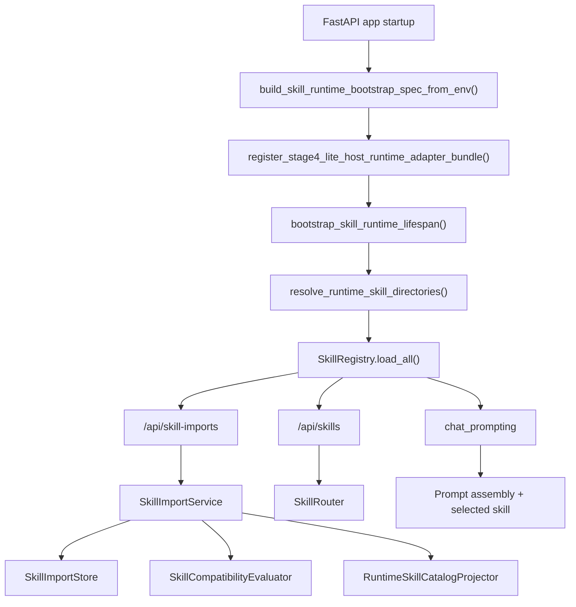
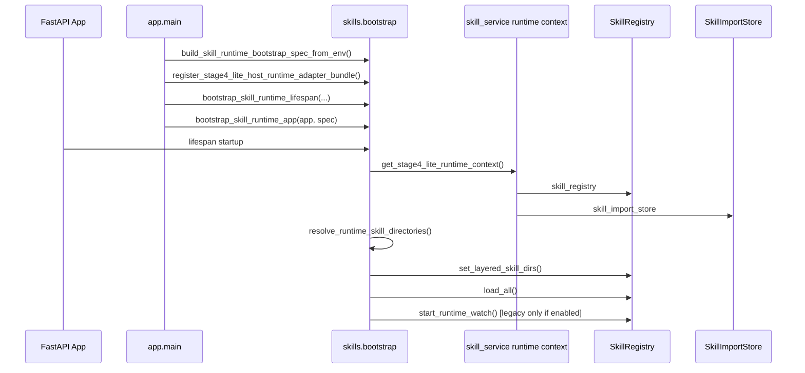
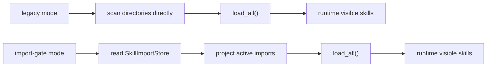

# Skill Runtime 当前运行机制说明

## 1. 这份文档的目的

这份文档解释 **当前 Yue 里的 Skill Runtime 到底是怎么运作的**。

它回答四个问题：

1. 技能是怎么被发现、导入和激活的
2. 运行时是怎么选技能、组装 prompt、执行路由的
3. `legacy` 与 `import-gate` 两种运行模式有什么差异
4. 哪些部分已经接近可复用，哪些部分仍然是 Yue 宿主逻辑

如果你要复用这套系统，建议先读这份，再读复用指南。

---

## 2. 先看整体结构

当前 Skill Runtime 由四层组成：

1. **核心领域层**
   - 技能模型、解析、校验、导入、兼容性、路由、动作执行
2. **运行时桥接层**
   - `skill_service.py`
   - runtime context / provider / seam
3. **宿主 API 层**
   - `/api/skills`
   - `/api/skill-imports`
   - `/api/skill-groups`
4. **宿主应用层**
   - `backend/app/main.py`
   - chat prompt assembly
   - agent/config/store integration

### 运行关系图



---

## 3. 核心文件职责

### 3.1 `backend/app/services/skills/`

这是技能子系统的主体，包含：

- `models.py`
- `parsing.py`
- `import_models.py`
- `import_store.py`
- `import_service.py`
- `compatibility.py`
- `policy.py`
- `registry.py`
- `routing.py`
- `actions.py`
- `runtime_catalog.py`
- `runtime_seams.py`
- `bootstrap.py`

这些文件负责技能的“数据面”和“运行面”。

### 3.2 `backend/app/services/skill_service.py`

这是当前的桥接中心，负责：

- 维护 Stage 4-Lite 的 runtime context
- 维护 host adapter bundle
- 保留历史兼容 seam
- 给 API、chat、lifespan 提供统一访问入口

它不是纯核心文件，因为里面还带着 Yue 宿主兼容逻辑。

### 3.3 `backend/app/api/skills.py`

提供技能查询和运行时路由接口，包括：

- 列表查询
- summary 查询
- 单技能详情
- reload
- runtime skill selection

### 3.4 `backend/app/api/skill_imports.py`

提供 import gate 的 API：

- 导入
- 列表
- 详情
- activate
- deactivate
- replace

### 3.5 `backend/app/main.py`

负责把 runtime 接到整个 FastAPI 应用里：

- 解析环境变量
- 初始化 host adapter
- 绑定 lifespan
- 挂载 routes
- 启动时加载 registry

---

## 4. 启动时发生了什么

当前启动流程比较清晰，核心步骤如下：

1. 读取 `.env`
2. 构造 host adapter bundle
3. 生成 runtime bootstrap spec
4. 创建 FastAPI app
5. 绑定 skill runtime lifespan
6. 挂载 skill runtime routes
7. 启动其他业务服务

### Runtime Construction Entry Inventory

为了避免继续把 `skill_service.py` 误读成“唯一 runtime 构造中心”，当前主线可以按下面这张表理解：

1. **Primary build entry**
   - `backend/app/services/skills/bootstrap.py`
   - `build_skill_runtime(...)`
   - 这是当前推荐的显式 runtime 构造入口
2. **Primary startup/bootstrap entry**
   - `backend/app/services/skills/bootstrap.py`
   - `build_skill_runtime_bootstrap_spec_from_env(...)`
   - `bootstrap_skill_runtime_lifespan(...)`
   - `bootstrap_skill_runtime_app(...)`
   - `mount_skill_runtime_routes(...)`
   - 这是 `main.py` 当前解释 startup 与 route mounting 的主路径
3. **Primary runtime access entry**
   - `backend/app/services/skill_service.py`
   - `get_stage4_lite_runtime_context()`
   - API 与运行时辅助逻辑应优先通过 runtime context / providers 读取依赖
4. **Compatibility singleton holder**
   - `backend/app/services/skill_service.py`
   - `_build_stage4_lite_runtime_singletons()`
   - `_stage4_lite_runtime_singletons`
   - 这条路径仍然存在，但角色已经降级为兼容壳层；默认构造也已经转为调用公开的 `build_skill_runtime(...)`
5. **Compatibility host wiring seam**
   - `backend/app/services/skill_service.py`
   - `register_stage4_lite_host_runtime_adapter_bundle(...)`
   - 这仍然负责把 Yue 宿主 adapter 接入 runtime，但它不是未来 pure core 的长期接口形态

换句话说：

- **构造 runtime**：优先看 `bootstrap.py`
- **读取 runtime**：优先看 `get_stage4_lite_runtime_context()`
- **兼容旧 patch seam / 默认单例**：再看 `skill_service.py`

### Visibility Resolution Inventory

当前可按两层理解 visibility 解析：

1. **Core routing default**
   - `backend/app/services/skills/routing.py`
   - 默认只解析 agent 自身字段：
     - `resolved_visible_skills`
     - `extra_visible_skills`
     - `visible_skills`
   - 不再把 `skill_group_store` 视为 core routing 的默认前提
2. **Yue host visibility adapter**
   - `backend/app/services/skills/host_adapters.py`
   - `GroupAwareAgentVisibilityResolver`
   - 负责把 Yue 的 `skill_groups -> skill refs` 语义接回 runtime router
3. **Compatibility wiring path**
   - `backend/app/services/skill_service.py`
   - `Stage4LiteHostAdapters`
   - `set_stage4_lite_host_adapters(...)`
   - Yue 默认运行时会把 host visibility resolver 绑定到 singleton router，因此现有行为保持兼容

### 详细启动链路



---

## 5. 两种运行模式

当前 runtime 支持两种模式。

### 5.1 `legacy`

`legacy` 模式的行为是：

1. 直接扫描配置目录
2. 加载 builtin / workspace / user 的技能目录
3. 可选开启 watch reload
4. 把目录发现的技能当成运行时可见技能

这种模式更接近“传统目录扫描式技能系统”。

### 5.2 `import-gate`

`import-gate` 模式的行为是：

1. 读取 `SkillImportStore`
2. 只投影 active 的导入项
3. 将 active import 映射成 runtime 可见目录
4. 重新构建 registry
5. 禁止某些 legacy 模式下的 mutation 行为

这种模式更接近“受控导入门禁”。

### 模式差异图



### 为什么当前默认偏向 import-gate

`runtime_catalog.py` 里当前默认会优先选择 `import-gate`，除非显式要求 `legacy`。

这样做的原因是：

1. 可以把“接受技能”和“发现文件”分开
2. 可以让 active state 成为显式状态
3. 更适合后续做迁移和复用

---

## 6. 技能是怎么被导入的

import gate 的入口在 `backend/app/api/skill_imports.py`。

### 导入流程

1. 前端或调用方提交一个 source directory
2. `SkillImportService.import_from_directory(...)`
3. 解析 skill package
4. 做结构校验
5. 做 compatibility 校验
6. 生成 preview
7. 生成 report
8. 保存 import record
9. 如果允许自动激活，则进入 active
10. active 后触发 runtime catalog refresh

### import record 包含什么

`import_models.py` 里存了导入状态的核心对象：

- `SkillImportRecord`
- `SkillImportReport`
- `SkillImportPreview`
- `SkillImportStoredEntry`

其中 record 主要记录：

- skill 名称
- version
- source type
- source ref
- lifecycle state
- reason code
- supersedes / superseded by

### lifecycle state

当前支持的生命周期状态有：

- `active`
- `inactive`
- `rejected`
- `superseded`

### import gate 的关键约束

导入并不等于激活。

一个 skill 可能：

- 标准上合法
- 但对 Yue 不兼容
- 或者依赖缺失
- 或者需要用户确认

所以导入后必须看 `report`，不能只看 `preview`。

---

## 7. 运行时是怎么选技能的

技能选择主要在 `backend/app/services/skills/routing.py` 和 `backend/app/api/skills.py` 里发生。

### 选择的输入

runtime selection 通常依赖：

- `agent_id`
- `task`
- `requested_skill`（可选）
- agent 的可见技能范围
- feature flag

### 选择的大致流程

1. 通过 host adapter 找到 agent
2. 检查 agent 的 `skill_mode`
3. 计算可见技能 refs
4. router 从可见技能中挑候选
5. 根据 task、name、description、capabilities 做轻量 lexical scoring
6. 如果用户指定了 requested skill，则优先匹配
7. 如果没有匹配到，则 fallback
8. 返回 `selected_skill`、`reason_code`、`fallback_used`

### debug contract

如果 debug 开关打开，还会返回：

- `selection_mode`
- `effective_tools`
- `selected`
- `candidates`
- `scores`
- `reason`
- `stage_trace`

这对排障很重要，因为它能告诉你：

- 为什么没选中
- 为什么 fallback
- 可见技能到底有哪些

---

## 8. 可见性是怎么计算的

可见性不是纯核心逻辑，而是核心逻辑 + 宿主策略的组合。

当前可见性主要来源于：

1. `resolved_visible_skills`
2. `skill_groups`
3. `extra_visible_skills`
4. `visible_skills`

也就是说，routing 需要知道：

- agent 想看到什么
- 哪些 group 关联到哪些 skill refs

这就是为什么当前 runtime 还不能完全脱离 Yue 宿主语义。

### 当前的适配方式

`skill_service.py` 提供了：

- `Stage4LiteHostAdapters`
- `Stage4LiteRuntimeProviders`
- `Stage4LiteRuntimeContext`

这些对象把：

- agent 查询
- feature flags
- skill group resolution

都收进了可替换的 adapter / provider seam。

---

## 9. runtime context 是什么

当前 runtime 通过 `Stage4LiteRuntimeContext` 把关键依赖聚合起来。

它包含：

- `skill_registry`
- `skill_router`
- `skill_action_execution_service`
- `skill_import_store`
- `skill_import_service`

### 为什么要有 runtime context

runtime context 的作用是把“全局单例依赖”变成“可注入依赖”。

这有三个好处：

1. 测试更容易 patch
2. 宿主可以替换 provider
3. 将来提取成独立 core 更容易

### 现在为什么还没完全纯化

因为为了兼容旧调用路径，`skill_service.py` 仍保留了一些模块级全局导出。

所以当前状态是：

- 已经 seam 化
- 但还没有完全移除 compatibility layer

这也是当前 Stage 4-Lite 收口的核心任务。

---

## 10. bootstrap 层做了什么

`backend/app/services/skills/bootstrap.py` 是当前非常关键的一层。

它负责把 runtime 变成一个可被宿主直接接入的模块。

### 10.1 配置解析

`resolve_skill_runtime_config_from_env(...)` 会读取：

- builtin skills dir
- workspace skills dir
- user skills dir
- data dir
- runtime mode
- watch enabled
- reload debounce

并且支持 host config adapter。

### 10.2 路由挂载

`mount_skill_runtime_routes(...)` 负责挂载：

- `/api/skills`
- `/api/skill-imports`
- `/api/skill-groups`

### 10.3 生命周期管理

`bootstrap_skill_runtime_lifespan(...)` 在 startup 时会：

1. 获取 runtime context
2. 解析 runtime directories
3. 确保 workspace / user 目录存在
4. 设置 registry layered dirs
5. 调用 `load_all()`
6. legacy mode 下可选启用 watch
7. shutdown 时停止 watch

这意味着：**技能系统不是靠 app 主循环“顺便初始化”，而是有专门的 bootstrap 生命周期。**

---

## 11. 宿主应用里发生了什么

在 `backend/app/main.py` 中，Yue 当前是这样接入 Skill Runtime 的：

1. 读取 `.env`
2. 构造 host adapter bundle
3. 生成 bootstrap spec
4. 创建 FastAPI app
5. 把 skill runtime lifespan 挂到 app 上
6. 调用 `bootstrap_skill_runtime_app(app, ...)`
7. 启动其他业务路由

这一步很重要，因为它说明 Skill Runtime 已经不是“散落在各处的工具函数”，而是一个能被主 app 明确编排的子系统。

---

## 12. 数据是怎么存的

当前 runtime 主要依赖文件型持久化。

典型持久化内容包括：

- `skill_imports.json`
- `skill_groups.json`
- `agents.json`

以及 runtime data 目录下的相关状态文件。

### 数据目录

默认情况下，`SKILL_RUNTIME_DATA_DIR` 或 `YUE_DATA_DIR` 会决定运行时数据根目录。

### 技能目录

当前分层目录包括：

- builtin
- workspace
- user
- import projection layer

这意味着不同来源的技能可以同时存在，但最终哪些进入 runtime 可见，取决于当前 mode。

---

## 13. 当前有哪些环境变量

现在比较关键的环境变量有：

- `SKILL_RUNTIME_BUILTIN_SKILLS_DIR`
- `SKILL_RUNTIME_WORKSPACE_SKILLS_DIR`
- `SKILL_RUNTIME_USER_SKILLS_DIR`
- `SKILL_RUNTIME_DATA_DIR`
- `SKILL_RUNTIME_MODE`
- `SKILL_RUNTIME_WATCH_ENABLED`
- `SKILL_RUNTIME_RELOAD_DEBOUNCE_MS`
- `SKILL_RUNTIME_API_PREFIX`
- `SKILL_RUNTIME_INCLUDE_SKILL_IMPORTS`
- `SKILL_RUNTIME_INCLUDE_SKILL_GROUPS`

同时还保留了 `YUE_*` 兼容别名，以便迁移时保持向后兼容。

### 当前推荐

如果你准备做复用或迁移，建议优先使用 `SKILL_RUNTIME_*` 这一组新名字。

---

## 14. 当前哪些部分更适合复用

更适合复用的部分是：

1. skill package parsing
2. structural validation
3. import report / preview / lifecycle model
4. compatibility evaluation
5. deterministic routing
6. runtime catalog projection
7. seam / adapter / bootstrap 机制

### 复用价值最高的点

最有价值的其实不是某一个 API，而是这套能力组合：

- import gate
- runtime selection
- visibility resolver
- host adapter boundary
- bootstrap lifecycle

这五个东西组合起来，才是一个真正可以搬走的 Skill Runtime Core。

---

## 15. 当前哪些部分仍然是 Yue 专属

下面这些还不应该直接当成核心包的一部分：

1. Yue 的 agent store 结构
2. Yue 的 config service
3. Yue 的 skill group store
4. Yue 的 chat prompt assembly 细节
5. Yue 的前端页面
6. Yue 的路由挂载习惯

这些应该继续待在 host adapter 层。

---

## 16. 当前运行机制的实际取舍

当前实现的取舍可以总结成一句话：

> 先保证可用和可测，再逐步把全局单例和宿主耦合清掉。

因此现在处于一个中间态：

- 逻辑已经分层
- seam 已经存在
- host adapter 已经可替换
- 但还没完全“核心化”

这不是缺陷，而是有意的演进阶段。

---

## 17. 当前运行流程的最小心智模型

如果你只记一版最小心智模型，可以记成下面这条链：

```text
host config + host adapters
    -> runtime bootstrap spec
    -> runtime context
    -> import gate / registry / router
    -> API / chat / prompt assembly
    -> runtime skill selection and execution
```

这条链里：

- 上半段是宿主负责
- 中间是 bootstrap / seam
- 下半段是 core 运行逻辑

---

## 18. 一个简单的执行示意

假设一个 agent 需要处理“总结 PDF”这个任务，runtime 会大致这样工作：

1. API 收到请求
2. 通过 host adapter 找到 agent
3. 计算 agent 可见技能
4. router 从可见技能里找候选
5. 若导入门禁开启，则只允许 active 的技能进入 runtime
6. 选出 skill 后，runtime 计算有效工具集
7. prompt 组装时把选中的 skill 注入到上下文
8. chat 层发起后续执行

这条链路说明了：Skill Runtime 不是孤立模块，它跟 chat、agent、config、store 都有关系。

---

## 19. 当前状态下的结论

### 已经做成的

- 导入门禁有独立模型与流程
- 路由有独立 router
- runtime context 已可注入
- API 已不再完全依赖模块级单例
- bootstrap 已经成型

### 还没完全做完的

- 模块级兼容壳层还在
- legacy/import-gate 双轨仍存在
- Yue 宿主语义还没有完全从 routing 里剥离
- full externalization 还在延期

### 对复用意味着什么

这说明现在已经到了一个很好的迁移窗口：

- 现在迁移，核心已经足够稳定
- 但又还没有大到无法拆分

---

## 20. 相关文档

- [Skill Runtime Core Reuse Guide](../guides/developer/SKILL_RUNTIME_CORE_REUSE_GUIDE.md)
- [Skill Runtime Core Externalization Plan](../plans/skill_runtime_core_externalization_plan_20260423.md)
- [Skill Runtime Core Phase 1 Refactor Plan](../plans/skill_runtime_core_phase1_refactor_plan_20260423.md)
- [Skill Import Gate Implementation Design](../plans/skill_import_gate_implementation_design_20260421.md)
- [Skill Import Runtime Execution Plan](../plans/skill_import_runtime_execution_plan_20260421.md)
