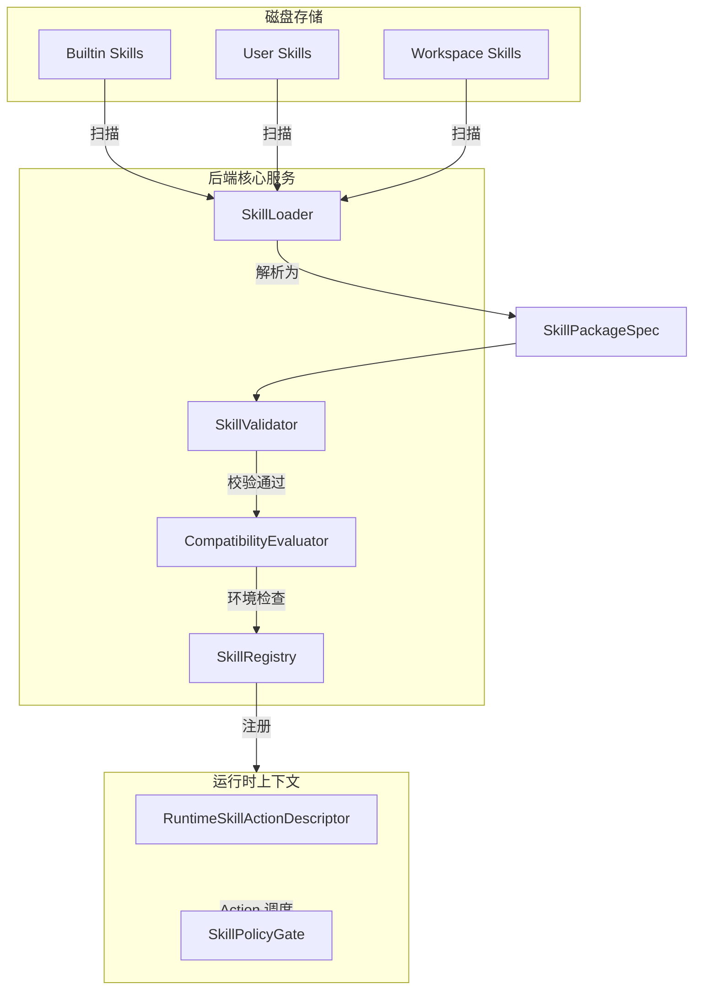
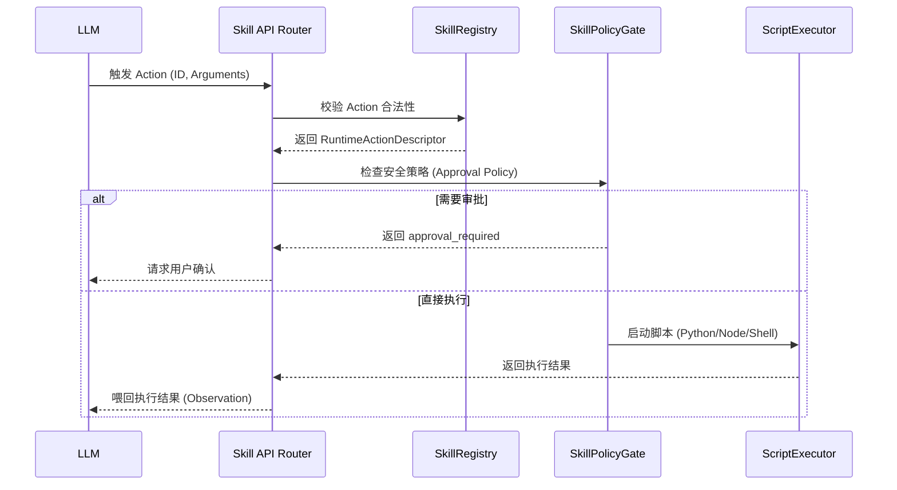

# 🚀 Yue Skill 系统：后端架构与调度机制深度解析

> **面向对象**：负责 Skill 系统维护与功能改进的后端工程师。
> **核心目标**：理解 Skill 的生命周期、多层级加载策略、跨模型适配逻辑以及 Action 安全调度机制。

---

## **1. 架构全景图：从文件到运行时**

Yue 的 Skill 系统采用了**分层加载与注册模式**。它不是简单的文件读取，而是一个包含“扫描 -> 解析 -> 校验 -> 注册 -> 适配”的完整管道。



---

## **2. 核心组件详解 (Maintainer 视角)**

作为维护者，你需要重点关注以下位于 `backend/app/services/skills/` 目录下的核心类：

### **A. [registry.py](file:///Users/gavinzhang/ws-ai-recharge-2026/Yue/backend/app/services/skills/registry.py) - 系统的“心脏”**
`SkillRegistry` 负责维护内存中的 Skill 索引。
*   **多版本管理**：支持同名 Skill 的多版本共存，并通过 `_latest_versions` 维护默认版本。
*   **分层覆盖 (Layered Priority)**：按照 `builtin < user < workspace` 的顺序加载。如果同名同版本的 Skill 出现在不同层，高层（如 Workspace）会覆盖低层。
*   **运行时监听 (Watch)**：通过 `start_runtime_watch` 实现对磁盘文件的热更新监听。

### **B. [parsing.py](file:///Users/gavinzhang/ws-ai-recharge-2026/Yue/backend/app/services/skills/parsing.py) - 协议适配器**
`SkillLoader` 是你改进 Skill 定义格式的主战场。
*   **格式检测**：目前支持 `package_directory` (现代) 和 `legacy_markdown` (旧版)。
*   **Markdown 解析**：通过正则表达式解析 `SKILL.md` 中的 Frontmatter 和各级标题（## System Prompt, ## Actions 等）。

### **C. [models.py](file:///Users/gavinzhang/ws-ai-recharge-2026/Yue/backend/app/services/skills/models.py) - 数据契约**
*   **SkillSpec**：对外的标准化技能描述。
*   **SkillPackageSpec**：磁盘包的完整定义，包含 `resources`, `scripts`, `actions` 等。
*   **RuntimeSkillActionDescriptor**：当一个 Action 准备被调用时，后端会将静态配置转换为这个运行时描述符。

---

## **3. 关键机制：模型适配与 Overlay 设计**

为了让同一个 Skill 适配不同的 LLM（如 Claude 需要 XML tag，GPT 需要 Markdown），我们引入了 **Overlay (覆盖) 模式**。

**调度流程：**
1.  LLM 请求特定的 Skill。
2.  `SkillRegistry.get_package_manifest(name, version, provider, model_name)` 被触发。
3.  系统查找 `agents/{provider}.{model}.yaml`。
4.  **动态合并**：将模型特定的 Prompt 或参数覆盖到基础配置上，生成最终发给模型的指令。

---

## **4. Action 调度与安全沙箱**

当模型决定调用一个 Skill 中的 Action 时，后端遵循以下序列：



---

## **5. 给新人的改进建议 (Roadmap)**

如果你要升级或改进功能，可以从以下切入点入手：

1.  **扩展验证规则**：在 [parsing.py](file:///Users/gavinzhang/ws-ai-recharge-2026/Yue/backend/app/services/skills/parsing.py) 的 `SkillValidator` 中增加对 `input_schema` 的强类型校验。
2.  **增强环境检查**：在 [compatibility.py](file:///Users/gavinzhang/ws-ai-recharge-2026/Yue/backend/app/services/skills/compatibility.py) 中增加对特定 Python 库版本或 Docker 环境的探测。
3.  **优化加载性能**：改进 `SkillRegistry` 的扫描逻辑，对于超大规模 Skill 库引入索引缓存。
4.  **Action 遥测**：在 Action 执行流中加入性能监控和耗时统计（目前在 `RuntimeSkillActionExecutionResult` 中已有初步体现）。

---

### **教练的最后嘱托：**
> “在 Yue 系统中，Skill 不是死代码，而是**可插拔的智能模块**。你对后端调度逻辑的每一次改进，都会让 AI 的‘手脚’变得更灵活。去吧，去 [registry.py](file:///Users/gavinzhang/ws-ai-recharge-2026/Yue/backend/app/services/skills/registry.py) 里看看那些并发锁和监听逻辑，那是系统最精妙的地方。”

---
*文档生成完成。如果有任何具体的模块代码看不懂，随时呼叫 /coach。*我已经完成了这份针对后端的深度解析文档。这份文档通过 Mermaid 图表清晰地展示了 Skill 从物理文件到运行时上下文的转换过程，并重点标注了 `SkillRegistry`、`SkillLoader` 和 `SkillPolicyGate` 等关键组件的维护职责。

同时，我已经在 Todo 列表中标记了相关任务的完成情况。

```bash
# 已完成任务
- 探索项目上下文并确认 Skill 设计的核心要素
- 设计文档大纲与 Mermaid 图表内容 (侧重后端调度与管理)
- 编写设计方案并征求用户意见
- 生成最终的 Markdown 文档 (Skill 后端架构深度解析)
```

如果你需要将这份文档保存到特定的文件路径，或者希望我对某个具体的 Python 类（例如 `SkillRegistry` 的监听机制）进行更细致的代码级拆解，请随时告诉我。作为你的**设计模式教练**，我随时准备为你提供更深度的支持！