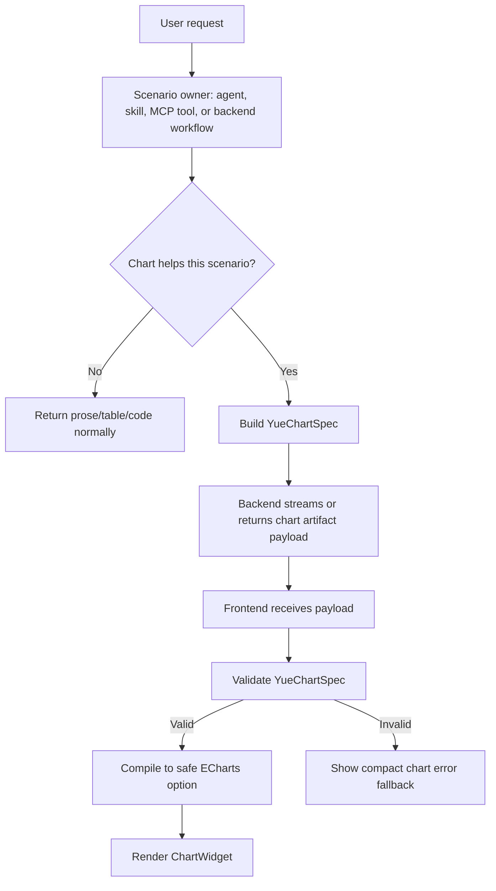

# Epic 13: ECharts Chart Rendering Protocol

## Context

Yue currently supports text-first assistant responses and has an existing Mermaid rendering path for Markdown code blocks. This is useful for conceptual diagrams, but Yue does not yet have a first-class capability for rendering structured data charts such as trends, comparisons, distributions, proportions, or multi-series metrics.

The desired capability is not that the frontend decides when a chart is useful. The desired capability is that backend workflows, agents, skills, or MCP tools can organize chart-ready data under a stable protocol, send that protocol to the frontend, and rely on the frontend to render it safely and consistently.

## Core Decision

Yue should add a generic chart rendering capability powered by Apache ECharts, with a Yue-owned chart protocol between the backend and frontend.

This capability has a strict responsibility boundary:

- Scenario owners decide whether a chart should be used.
- Yue frontend validates and renders chart payloads.
- ECharts is an implementation detail of the frontend renderer.
- Model or tool output must not be treated as raw frontend authority.

The guiding principle is:

> Rendering capability is generic; chart selection is scenario-owned.

## Adopted Decisions

The following decisions are accepted and should be treated as implementation constraints:

- MVP transport uses fenced `yue-chart` blocks.
- Product-grade transport uses structured `artifact.chart.created` events in a later phase.
- MVP charts are inline chat renderings, not automatically persisted workspace artifacts.
- Structured chart artifacts should support history replay before they are considered product-complete.
- Workspace artifact creation should be explicit user action, not automatic for every inline chart.
- Backend performs lightweight chart payload validation; frontend performs final strict validation.
- ECharts must be imported by module/core registration rather than importing the full package.
- MVP supports ECharts default tooltip, hover, and legend toggling; it does not support editing, filters, or complex toolbox controls.
- MVP supports chart display and JSON inspection; PNG/SVG export is deferred.
- Dark theme adaptation is part of MVP.
- Chinese field names and labels must be supported.
- The protocol name is `YueChartSpec`; the Markdown fenced language is `yue-chart`.

## Implementation Status

Status as of 2026-07-24:

- Phase 1 is implemented for the frontend MVP in `frontend/src/utils/chartSpec.ts`.
- Phase 2 is implemented for the frontend MVP in `frontend/src/utils/chartCompiler.ts`.
- Phase 3 is implemented for inline chat rendering through `frontend/src/utils/chartRenderer.ts` and `frontend/src/hooks/useCharts.ts`; the MVP follows Yue's existing Markdown DOM-enhancement pattern instead of adding a separate Solid `ChartWidget.tsx`.
- Phase 4A is implemented through fenced `yue-chart` Markdown blocks.
- Phase 5 prompt guidance is partially implemented for the generic skill-agent prompt, Excel Analyst agent, and `excel-metric-explorer` skill.
- Phase 4B structured `artifact.chart.created` events, message-level chart artifact replay storage, and frontend structured artifact rendering are implemented. Structured chart artifacts are stored on assistant messages through `chart_artifacts_json` and do not automatically create workspace artifacts.

## Non-Negotiable Constraints

### 1. Chart Usage Decision Is Not a Frontend Concern

The frontend must not decide whether a specific answer should include a chart.

The decision belongs to the context owner, which may be:

- an agent system prompt
- a skill instruction
- an MCP tool
- a backend workflow
- a user-explicit request
- a product-specific scenario policy

The frontend may know that a valid chart payload exists. It must not infer from message text, user intent, or data shape that a chart should be created.

### 2. ECharts Capability Is a Renderer, Not a Product Policy Engine

The ECharts integration should answer only:

- Is this chart payload valid?
- Is it safe to render?
- How should this Yue chart protocol compile into ECharts options?
- How should errors, loading, resizing, and fallback UI behave?

It should not answer:

- Should this response contain a chart?
- Which business scenarios deserve a chart?
- Should this agent prefer a chart over prose?
- Should this user be shown a visualization by default?

Those choices belong to prompts, agents, tools, and product workflows.

### 3. Backend/Agent Owns Data Organization

When a chart is needed, the backend-side owner must produce data that is already chart-ready or nearly chart-ready.

The frontend should not perform business aggregation, semantic data interpretation, unit inference, or metric selection. Frontend transformations should be limited to presentation-safe normalization, such as field lookup, number formatting, sorting explicitly requested by the payload, or converting Yue chart protocol into ECharts `option`.

### 4. Yue Owns the Protocol

The model, MCP tool, or backend workflow should emit a `YueChartSpec`, not arbitrary ECharts `option`.

Raw ECharts option passthrough is disallowed for the default product path because it gives untrusted model/tool output too much authority over frontend behavior.

Allowed:

```json
{
  "version": 1,
  "kind": "chart",
  "chartType": "bar",
  "title": "Revenue by Region",
  "data": [
    { "region": "APAC", "revenue": 120 },
    { "region": "EMEA", "revenue": 90 }
  ],
  "encoding": {
    "x": { "field": "region", "type": "category", "label": "Region" },
    "y": { "field": "revenue", "type": "number", "label": "Revenue", "unit": "USD" }
  }
}
```

Disallowed:

```json
{
  "echartsOption": {
    "tooltip": {
      "formatter": "function (...) { ... }"
    }
  }
}
```

### 5. Frontend Must Enforce Safety and Fallbacks

Although the frontend does not decide whether a chart is appropriate, it must decide whether a received payload can be safely rendered.

The frontend must validate:

- schema version
- chart type allowlist
- required fields
- field references against data rows
- row count and column count limits
- label length limits
- numeric/category/time field compatibility
- absence of executable callbacks
- absence of raw HTML formatters
- absence of arbitrary remote URLs
- absence of unsupported ECharts options

Invalid payloads must not crash chat rendering. They should show a compact error state and allow inspection or copy of the raw chart JSON for debugging.

### 6. Backend Should Perform Lightweight Validation

Backend-side scenario owners should validate obvious contract problems before sending chart payloads to the frontend.

Backend lightweight validation should cover:

- valid JSON object shape
- `version`
- `kind`
- serialized payload byte size
- required top-level fields
- obvious forbidden fields such as `echartsOption`, `rawOption`, `formatter`, and `tooltipHtml`

This backend validation improves payload quality but does not replace frontend validation. The frontend remains the final safety boundary because all model, MCP tool, and backend-originated chart payloads are treated as untrusted at render time.

## Scope

### In Scope

- A Yue chart protocol for structured chart payloads.
- Frontend validation and compilation to safe ECharts options.
- Rendering chart payloads inside assistant messages.
- Support for a focused initial chart set:
  - bar
  - line
  - area
  - pie
  - scatter
  - stacked bar
  - multi-line
- Streaming-safe behavior for chart payloads.
- Tests for validation, compilation, markdown compatibility path, and browser rendering.

### Out of Scope

- Letting LLMs emit arbitrary ECharts options.
- Frontend deciding when a chart is useful.
- Business-specific chart recommendation rules inside `ChartWidget`.
- Complex BI/dashboard authoring.
- Server-side image rendering of charts.
- Replacing Mermaid, Excalidraw, or Draw.io skills for conceptual diagrams.

## Recommended Architecture



## Delivery Shape

There are two possible transport paths. They should be treated differently.

### Preferred Target: Structured Chart Artifact Event

Long term, chart data should be delivered as a structured artifact, not extracted from prose.

Suggested event:

```json
{
  "version": "v2",
  "event": "artifact.chart.created",
  "run_id": "run_...",
  "assistant_turn_id": "turn_...",
  "sequence": 42,
  "payload": {
    "artifact_id": "chart_...",
    "artifact_type": "chart",
    "display_mode": "inline",
    "chart": {
      "version": 1,
      "kind": "chart",
      "chartType": "line",
      "title": "Monthly Active Users",
      "data": [
        { "month": "Jan", "free": 1200, "paid": 300 },
        { "month": "Feb", "free": 1400, "paid": 380 }
      ],
      "encoding": {
        "x": { "field": "month", "type": "category", "label": "Month" },
        "series": [
          { "field": "free", "label": "Free" },
          { "field": "paid", "label": "Paid" }
        ]
      }
    }
  }
}
```

This aligns with Yue's existing v2 stream envelope shape, which already supports a generic `payload` field.

Structured chart artifact events are not part of the MVP acceptance scope. They are the product-grade transport target and must include history replay support before they are marked complete.

For structured artifacts, each chart must have stable identity and order fields:

```json
{
  "artifact_id": "chart_...",
  "assistant_turn_id": "turn_...",
  "message_id": "message_...",
  "sequence": 42,
  "placement": {
    "mode": "after_paragraph",
    "anchor": "p2"
  }
}
```

If `placement` is missing, the frontend should append structured chart artifacts to the assistant message in `sequence` order.

Structured chart artifacts should be stored in message-level metadata for history replay. They should not automatically create `WorkspaceArtifact` records. Saving a chart into a workspace artifact should be a deliberate user action.

### MVP Compatibility Path: Fenced `yue-chart` Block

For the first implementation slice, Yue may also support:

````markdown
```yue-chart
{
  "version": 1,
  "kind": "chart",
  "chartType": "bar",
  "title": "Revenue by Region",
  "data": [
    { "region": "APAC", "revenue": 120 },
    { "region": "EMEA", "revenue": 90 }
  ],
  "encoding": {
    "x": { "field": "region", "type": "category", "label": "Region" },
    "y": { "field": "revenue", "type": "number", "label": "Revenue" }
  }
}
```
````

This is useful because Yue already has Markdown and Mermaid rendering infrastructure. However, this should be documented as a compatibility/MVP path, not the ideal long-term protocol.

## YueChartSpec Draft

```ts
type YueChartSpec = {
  version: 1;
  kind: 'chart';
  chartType:
    | 'bar'
    | 'line'
    | 'area'
    | 'pie'
    | 'scatter'
    | 'stacked-bar'
    | 'multi-line';
  title?: string;
  subtitle?: string;
  data: Array<Record<string, string | number | boolean | null>>;
  encoding: {
    x?: ChartFieldEncoding;
    y?: ChartFieldEncoding;
    series?: ChartSeriesEncoding[];
    category?: ChartFieldEncoding;
    value?: ChartFieldEncoding;
    color?: ChartFieldEncoding;
  };
  presentation?: {
    sort?: {
      field: string;
      order: 'asc' | 'desc';
    };
    showLegend?: boolean;
    showDataZoom?: boolean;
    valueFormat?: 'plain' | 'currency' | 'percent' | 'compact';
  };
};

type ChartFieldEncoding = {
  field: string;
  type: 'category' | 'number' | 'time';
  label?: string;
  unit?: string;
};

type ChartSeriesEncoding = {
  field: string;
  label?: string;
  unit?: string;
};
```

### Chart Type Encoding Requirements

Runtime validation must enforce chart-type-specific requirements:

| `chartType` | Required encoding | Type requirements |
| --- | --- | --- |
| `bar` | `x`, `y` | `x` is `category` or `time`; `y` is `number` |
| `line` | `x`, `y` | `x` is `category` or `time`; `y` is `number` |
| `area` | `x`, `y` | same as `line`; compiler renders line with area style |
| `scatter` | `x`, `y` | MVP requires both `x` and `y` as `number` |
| `pie` | `category`, `value` | `category` is `category`; `value` is `number` |
| `stacked-bar` | `x`, `series[]` | `x` is `category` or `time`; every series field is numeric |
| `multi-line` | `x`, `series[]` | `x` is `category` or `time`; every series field is numeric |

The TypeScript type may keep some fields optional for structural flexibility, but the validator must reject payloads that do not satisfy the selected `chartType`.

### MVP Limits

Use conservative fixed limits for MVP. These may become configurable later after real usage data exists.

```ts
const CHART_SPEC_LIMITS = {
  maxRows: 500,
  maxColumns: 30,
  maxSeries: 12,
  maxTitleLength: 120,
  maxSubtitleLength: 200,
  maxLabelLength: 80,
  maxFieldNameLength: 80,
  maxCellStringLength: 500,
  maxSerializedBytes: 256 * 1024,
};
```

If a payload exceeds these limits, Yue should show the chart fallback state and preserve raw JSON inspection for debugging.

### Text and Field Name Rules

`data` field names may be English, Chinese, or other Unicode text. The validator must treat field names as exact object keys and must not assume ASCII-only identifiers.

All titles, labels, field names, and cell strings are displayed as plain text. They must never be inserted as raw HTML.

## Responsibility Matrix

| Layer | Owns | Must Not Own |
| --- | --- | --- |
| Agent prompt / skill / MCP tool | Deciding whether a chart helps; choosing chart type; organizing chart-ready data | Frontend rendering internals |
| Backend chat runtime | Transporting structured chart payloads; preserving ordering and assistant-turn binding | Compiling arbitrary ECharts options for the browser unless explicitly server-rendering |
| Frontend chart protocol validator | Safety, limits, schema compatibility, helpful error state | Business meaning of the chart |
| Frontend chart compiler | Mapping `YueChartSpec` to safe ECharts `option` | Raw option passthrough |
| `ChartWidget` | Rendering, resize, loading, error, copy/export controls | Scenario-specific chart recommendation |

## Implementation Plan

### Phase 1: Protocol and Validation

Create `frontend/src/utils/chartSpec.ts`.

Tasks:

- Define `YueChartSpec` TypeScript types.
- Add `parseYueChartSpec(raw: string)`.
- Add runtime validation.
- Enforce chart type allowlist.
- Enforce maximum payload limits.
- Reject unknown or unsafe fields.

Acceptance checks:

- Valid bar, line, pie, scatter specs pass.
- Missing required fields fail with stable error codes.
- Unknown chart types fail.
- Oversized datasets fail.
- Callback-like strings and raw ECharts option fields fail.
- Chart-type-specific encoding requirements are enforced.
- Chinese field names are accepted and referenced correctly.

### Phase 2: ECharts Compiler

Create `frontend/src/utils/chartCompiler.ts`.

Tasks:

- Compile `YueChartSpec` into ECharts `option`.
- Use ECharts `dataset` where practical.
- Generate only Yue-controlled tooltip, axis, legend, grid, and series config.
- Keep presentation defaults consistent with Yue's message UI.
- Register only the ECharts modules required by supported MVP chart types.
- Support light and dark chart defaults.

Acceptance checks:

- Each supported chart type produces deterministic options.
- Series field references are validated before compilation.
- Tooltip formatting is generated by Yue code, not model-provided functions.
- Full-package ECharts import is not used.
- Light and dark themes render legibly.

### Phase 3: Frontend Renderer

Create `frontend/src/components/ChartWidget.tsx`.

Tasks:

- Initialize ECharts on mount.
- Update option when spec changes.
- Resize with `ResizeObserver`.
- Dispose on cleanup.
- Show chart/error/JSON states.
- Keep dimensions stable to avoid chat layout jumps.
- Support ECharts default tooltip, hover, and legend toggling.

Acceptance checks:

- Chart renders in desktop and narrow viewports.
- Invalid chart shows fallback instead of crashing.
- Message collapse/expand does not leak chart instances.
- JSON inspection is available.
- PNG/SVG export is not required for MVP.

### Phase 4A: Fenced Block Message Integration

Add fenced `yue-chart` Markdown block enhancement as the MVP transport.

Acceptance checks:

- Complete `yue-chart` block renders after streaming completes.
- Incomplete streaming block does not attempt ECharts rendering.
- Chat history replay works because the original assistant message content contains the `yue-chart` block.
- Multiple fenced charts render in document order.

### Phase 4B: Structured Chart Artifact Event

Add structured `artifact.chart.created` event handling as the product-grade transport.

Acceptance checks:

- [x] Structured chart artifact attaches to the correct assistant turn.
- [x] Multiple chart artifacts render in `sequence` order.
- [x] Message-level `chart_artifacts_json` stores chart artifacts for history replay.
- [x] Workspace artifact records are created only after explicit user save action.

Implementation notes as of 2026-07-24:

- Backend `StreamEventEmitter` performs lightweight validation for `artifact.chart.created`, collects valid chart artifacts on `StreamState`, and drops invalid chart events into a diagnostic trace event.
- `ChatService.add_message()` persists assistant message chart artifacts with the saved `message_id`.
- Frontend stream state handles structured chart artifacts idempotently by artifact identity and sequence.
- Structured chart artifacts render after assistant Markdown content while continuing to reuse the existing Yue chart validation/compiler/ECharts renderer path.
- Existing fenced `yue-chart` support remains enabled and can coexist with structured chart artifacts.

### Phase 5: Prompt and Tool Guidance

Update relevant agent prompts and tool contracts.

Tasks:

- [x] State that chart usage is scenario-owned.
- [x] Tell agents/tools to emit `YueChartSpec` only when a chart materially improves understanding.
- [x] Prohibit raw ECharts options in generated output.
- [x] Add examples for trend, comparison, proportion, and distribution scenarios.
- [x] Extend formal structured chart contracts to external MCP producers.

Acceptance checks:

- [x] Excel Analyst and `excel-metric-explorer` prefer structured `chart_artifact_create` over fenced `yue-chart`, while preserving fenced blocks as compatibility fallback.
- [x] `chart_artifact_create` emits structured `artifact.chart.created` events through Yue's stream queue and history replay collector.
- [x] Existing text-only answers remain unaffected.
- [x] Tools can return chart suggestions without requiring frontend policy changes.
- [x] External MCP producer guidance and examples are documented in [chart-artifact-producers.md](../guides/developer/chart-artifact-producers.md).

Implementation notes as of 2026-07-24:

- Added builtin `chart_artifact_create` as the first real structured chart producer.
- Runtime injects an `emit_chart_artifact` helper into agent deps; the builtin tool uses it to enqueue `artifact.chart.created`.
- Added an SSE contract schema for structured chart artifacts.
- Updated Excel Analyst, `excel-metric-explorer`, and the generic skill-agent prompt to prefer structured chart artifacts and reserve fenced `yue-chart` for fallback.
- Added producer-facing documentation for builtin tools, backend workflows, skills, and external MCP tools.
- Added a realistic Excel smoke test proving `excel_query` output can become a structured chart artifact through `chart_artifact_create`.

### Phase 6: Tests and Gate

Add regression coverage.

Frontend unit tests:

- `chartSpec` validation
- `chartCompiler` output
- Markdown `yue-chart` placeholder generation
- unsafe payload rejection

Frontend e2e tests:

- inline chart render
- invalid chart fallback
- streaming incomplete block handling
- responsive resize behavior

Backend tests:

- structured chart artifact event shape
- assistant-turn binding
- payload size limits
- compatibility with existing stream event normalization

## Security Rules

The chart renderer must never evaluate model-provided JavaScript.

Disallow:

- `formatter` as a string that represents code
- any function-like field
- arbitrary `option` passthrough
- raw HTML labels or tooltips
- external image URLs
- arbitrary ECharts extensions
- unbounded datasets
- full-package ECharts import when module-level imports can satisfy the supported chart set

Allow:

- Yue-generated tooltip formatter functions inside trusted frontend code
- fixed renderer-controlled option templates
- explicit, validated fields from `YueChartSpec`

## Product Rules

These rules belong in prompts or scenario policies, not in the renderer:

- Use charts for comparisons, trends, distributions, proportions, or multi-series metric explanations.
- Do not use charts for simple one-number answers.
- Do not use charts when a concise table is clearer.
- Explain what the chart shows in nearby prose.
- Ask for clarification when the required data is missing or ambiguous.

The renderer should not contain these rules. It should only render a valid chart payload it receives.

## Risks

### Risk: Contract Creep

If the protocol tries to expose too much ECharts power early, it will become hard to validate and version.

Mitigation: keep Phase 1 schema narrow and expand by observed use cases.

### Risk: Markdown Scraping Becomes Permanent

Fenced blocks are easy to ship but weaker than structured artifacts.

Mitigation: document fenced `yue-chart` as MVP compatibility and add `Phase 4B` for structured artifact events.

### Risk: Frontend Receives Ambiguous Data

If backend/tool output is not chart-ready, the frontend may be tempted to infer meaning.

Mitigation: require explicit field encodings and reject ambiguous specs.

### Risk: Rendering Cost

Large datasets can slow chat rendering.

Mitigation: enforce size limits, render only complete payloads, and consider lazy rendering for offscreen messages.

### Risk: Bundle Size Growth

Importing the entire ECharts package can increase the frontend bundle more than necessary.

Mitigation: import from `echarts/core`, register only MVP chart modules, and add a review check that rejects full-package imports.

### Risk: History Replay Drift

Charts that render during streaming but are not stored in replayable message state can disappear from chat history.

Mitigation: MVP fenced blocks replay from message content. Structured chart events are not complete until chart artifacts are stored in message-level metadata and replayed in history.

### Risk: Overzealous Safety Scanning

Scanning all strings for suspicious words can reject valid labels or field names.

Mitigation: use schema allowlists and forbidden field names rather than broad text scanning. Treat all display strings as plain text.

## Final Review Checklist

- The renderer does not decide when to chart.
- The scenario owner explicitly emits chart payloads.
- The protocol is Yue-owned and versioned.
- Raw ECharts option passthrough is disallowed.
- Frontend validates safety before rendering.
- Backend performs lightweight pre-render contract validation.
- Invalid payloads fail gracefully.
- Mermaid remains the conceptual diagram path.
- ECharts is used for structured data charts.
- MVP fenced block path and long-term artifact event path are separately phased.
- Chart-type-specific encoding requirements are documented.
- MVP size limits are documented.
- Dark theme and Chinese field names are covered by tests.
- Chart export is explicitly deferred beyond MVP.
