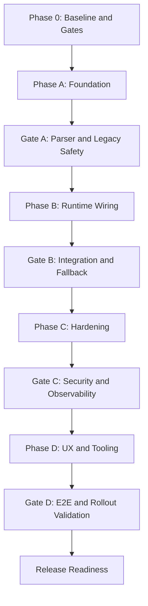
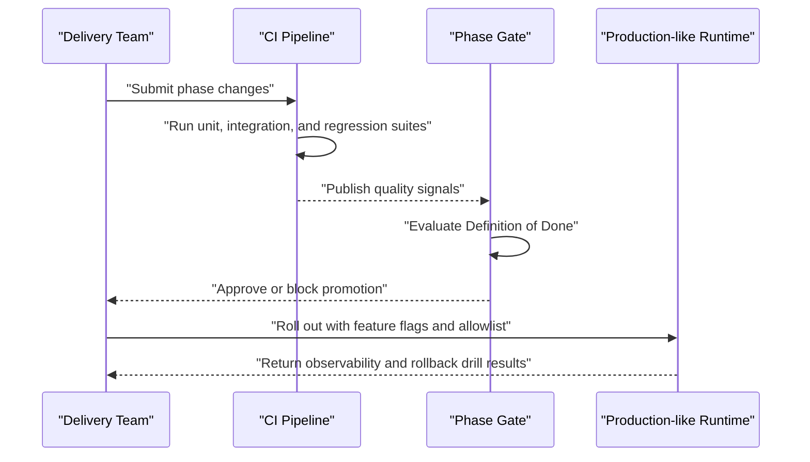

# Markdown-Defined Skills Plan (Phase 6.2)

## Scope

This document expands ROADMAP item **6.2 Markdown-Defined Skills (Markdown 技能系统)** into an implementation-ready plan.

## Goals
- Treat Skills as first-class runtime capabilities aligned with Claude Code and OpenClaw skill concepts.
- Let users define and extend capabilities through Markdown-based skill files.
- Provide a robust loader and validator to support safe dynamic capability injection.

## Non-Goals
- Replacing the existing tool registry architecture in one step.
- Building a public marketplace for skill distribution in this phase.
- Executing untrusted code embedded in skill files.

---

## Confirmed Decisions

The following decisions are confirmed as the implementation baseline.

1. **Scope of Enablement**
   - Enable skill capability only for selected agents.

2. **Per-Agent Skill Mode**
   - Support `off | manual | auto`, default to `off`.

3. **Visible Skill Boundary**
   - Use agent-scoped `visible_skills` allowlist.

4. **Tool Authorization Merge Rule**
   - Enforce `final_tools = agent.enabled_tools ∩ skill.allowed_tools`.

5. **Prompt Composition Strategy**
   - Use structured layering: `Agent Persona` + `Skill Instructions` + `Runtime Constraints`.

6. **Skill Selection Trigger**
   - Use `Router + Policy Gate + model suggestion`.

7. **Version Selection Policy**
   - Use pinned version in production; latest compatible in development.

8. **Selector as a Tool**
   - Expose selector tool only to skill-capable agents, with strict policy checks and auditing.

---

## Skill Model

Each skill is a Markdown document with frontmatter plus structured sections.

### Required Frontmatter
- `name`: Stable skill name used by registry and runtime.
- `version`: Semantic version for compatibility checks.
- `description`: Short user-facing summary.
- `capabilities`: Declared ability list used for routing and policy checks.
- `entrypoint`: Primary prompt section identifier.

### Optional Frontmatter
- `inputs_schema`: Reference or inline JSON Schema for expected inputs.
- `outputs_schema`: Reference or inline JSON Schema for expected outputs.
- `constraints`: Runtime constraints such as max tokens, timeout, allowed tools.
- `compatibility`: Runtime and protocol compatibility metadata.

### Markdown Sections
- `## System Prompt`: Core behavior and guardrails.
- `## Instructions`: Task-specific operating instructions.
- `## Examples`: Few-shot examples and edge-case demonstrations.
- `## Failure Handling`: Fallback behavior and error messaging guidance.

---

## Architecture Plan

### 0) Enablement Strategy (Agent-Scoped Hybrid Mode)
- Keep existing legacy agent behavior unchanged by default.
- Add per-agent fields:
  - `skill_mode`: `off | manual | auto` (default `off`)
  - `visible_skills`: explicit allowlist for skill discovery
  - `skill_selection_policy`: optional override for routing thresholds and fallback
- Only agents with `skill_mode != off` participate in skill discovery/selection.
- All other agents continue with fixed `system_prompt + enabled_tools`.

### 0.1) Unified Runtime Abstraction
- Define `RuntimeCapabilityDescriptor` (or alias existing `SkillRuntimeDescriptor`) as the single runtime contract.
- Standardized fields:
  - `prompt_blocks`
  - `tool_policy`
  - `constraints`
  - `source_type` (`legacy_agent` or `markdown_skill`)
- All runtime selection, policy checks, and prompt assembly consume this unified descriptor instead of source-specific models.

### 0.2) Dual Adapters (No Dual Runtime Implementations)
- `LegacyAgentAdapter`: `AgentConfig -> RuntimeCapabilityDescriptor`
- `MarkdownSkillAdapter`: `SkillSpec -> RuntimeCapabilityDescriptor`
- Keep one execution pipeline; adapters only normalize inputs from different sources.

### 1) Discovery and Registry
- Scan configured skill directories on startup.
- Build an in-memory skill index keyed by `(name, version)`.
- Expose skill metadata to planner and runtime selector.

### 2) Parsing and Normalization
- Parse Markdown frontmatter and canonical sections.
- Normalize missing optional fields with safe defaults.
- Emit normalized `SkillSpec` objects for downstream use.

### 3) Validation
- Validate required metadata and section completeness.
- Validate `inputs_schema` and `outputs_schema` JSON Schema syntax.
- Validate policy constraints and deny unsafe declarations.
- Fail closed for invalid skills and report actionable diagnostics.

### 4) Runtime Injection
- Convert validated `SkillSpec` into runtime-executable capability descriptors.
- Inject descriptors into agent capability resolution without restarting service.
- Resolve descriptors through agent-scoped visibility rules (`visible_skills`).
- Enforce final tool set by intersection policy (`agent.enabled_tools ∩ skill.allowed_tools`).
- Keep prompt construction layered: `Agent Persona` + `Skill Instructions` + `Runtime Constraints`.
- Keep injection fail-open for core chat path and fail-closed for invalid skill.

### 5) Reload and Versioning
- Support manual reload endpoint and optional file-watch reload mode.
- Keep multiple versions side-by-side with explicit selection policy.
- Prefer pinned versions in production, latest compatible in development.

### 6) Selection Strategy (Configurable)
- `manual`: front-end or request explicitly selects skill.
- `auto`: router selects skill by capabilities and policy.
- `hybrid`: try explicit user selection first; fallback to `auto` when explicit selection is missing or invalid.
- Emit selection reason and fallback path for observability.

### 7) Session Consistency and Fallback Semantics
- Pin selected skill version at chat-session scope once resolved (`session_skill_binding`).
- Do not switch skill version mid-session unless explicit user/system reset.
- If skill execution path fails at runtime, fallback to legacy agent path in the same turn when safe.
- Persist fallback reason for each fallback event (`validation_failed`, `policy_denied`, `runtime_error`, `not_found`).

### 8) Rollout and Kill Switch
- Gate skill runtime by feature flags:
  - `skill_runtime_enabled`
  - `skill_selector_tool_enabled`
  - `skill_auto_mode_enabled`
- Support immediate kill-switch rollback to legacy-only behavior without restart.
- Enable progressive rollout by agent allowlist and environment.
- Define rollback SLO: rollback propagation time under 1 minute.

---

## Compatibility Strategy

### Claude Code / OpenClaw Alignment
- Keep metadata fields close to common skill concepts: identity, prompt blocks, constraints.
- Preserve extension fields for future format parity without breaking current parser.
- Add compatibility adapters to map external skill formats into internal `SkillSpec`.

### Backward Compatibility
- Unknown fields are preserved as extension metadata.
- Missing optional sections use defaults and warnings, not hard failures.
- Breaking schema changes require version bump and migration notes.

---

## Security and Safety

- Reject skill files that request prohibited tools or unsafe permissions.
- Apply prompt redaction rules to prevent secret leakage in logs.
- Enforce runtime limits from constraints: token, time, and tool-call boundaries.
- Store validation and load events for audit and incident triage.
- Enforce default no-privilege-escalation for dynamic selection (`agent.enabled_tools ∩ skill.allowed_tools`).
- Any privilege elevation requires explicit approval (`human-in-the-loop`) and is fully audited.

---

## API and Internal Interfaces

### Internal Types
- `SkillSpec`: Normalized parsed skill representation.
- `SkillValidationResult`: Structured validation output with errors and warnings.
- `SkillRuntimeDescriptor`: Runtime-ready capability object used by planner/executor.
- `RuntimeCapabilityDescriptor`: Unified runtime contract used after adapter normalization.
- `SessionSkillBinding`: Session-level resolved skill metadata (`name`, `version`, `mode`, `source_type`).

### Internal Services
- `SkillLoader`: Discovery, parse, normalize.
- `SkillValidator`: Schema and policy validation.
- `SkillRegistry`: Versioned registration, lookup, and reload.
- `SkillRouter`: Agent-scoped skill filtering, ranking, and fallback.
- `SkillPolicyGate`: Authorization checks for selection and runtime binding.

### Operational Endpoints
- `POST /api/skills/reload`: Reload skills from configured directories.
- `GET /api/skills`: List loaded skills and validation status.
- `GET /api/skills/{name}`: Get selected skill metadata and active version.
- `POST /api/skills/select`: Resolve best skill for an eligible agent and task.
- `POST /api/skills/tool/select_runtime_skill`: Tool entrypoint for controlled runtime selection.

### API Contract Details
- `POST /api/skills/select` request:
  - `agent_id`: target agent id
  - `task`: user task text
  - `mode`: `manual | auto | hybrid`
  - `requested_skill` (optional): explicit skill name/version
- `POST /api/skills/select` response:
  - `selected_skill` (`name`, `version`)
  - `selection_mode`
  - `reason_code`
  - `fallback_used` (boolean)
  - `effective_tools` (post-policy tool list)
- Standard error codes:
  - `skill_not_found`
  - `skill_policy_denied`
  - `skill_validation_failed`
  - `skill_selection_unavailable`
  - `skill_selector_disabled`

### Routing Determinism
- Router ranking should be deterministic for identical inputs.
- Tie-break order:
  1. higher capability match score
  2. stricter policy compliance score
  3. pinned/preferred version match
  4. lexical order of skill name as final deterministic tie-breaker

---

## Delivery Phases

### Delivery Method (Small Steps with Test Gates)
- Execute in strict incremental phases; no big-bang rollout.
- Do not start next phase until current phase passes all mandatory test gates.
- Keep main chat path fail-open for skill subsystem failures in every phase.
- Use feature flags and allowlist rollout to limit blast radius.

### 🔶 Front-End Manual Validation Highlights (需人工介入)
- 🔶 **[Manual UI Test] Phase B + Phase D**: verify manual skill selection (`manual` mode) from front-end request flow, and confirm visible response behavior differs from legacy path.
- 🔶 **[Manual UI Test] Phase D**: verify agent-level controls (`skill_mode`, `visible_skills`) in admin/developer UI and confirm save/reload effects are reflected in chat behavior.
- 🔶 **[Manual UI Test] Gate D**: verify end-to-end UI path for control changes, chat runtime behavior changes, and rollback impact under production-like environment.
- 🔶 **[Manual UI Test] Rollout**: verify allowlist agent experience differs from non-allowlist agents in front-end, including capability availability and fallback behavior.

### Phase 0: Baseline and Gates
- Freeze current legacy agent behavior as baseline reference.
- Establish mandatory regression suite for `skill_mode=off` agents.
- Establish performance baseline (selection latency, fallback rate, TTFT impact).
- Define rollback procedure and verify kill-switch path.

### Phase A: Foundation
- Define `SkillSpec` and parser for frontmatter + sections.
- Add baseline validator and registry with startup loading.
- Add `skill_mode` / `visible_skills` to agent configuration model.

### Phase B: Runtime Wiring
- Inject registered skills into planner capability selection.
- Add reload endpoint and runtime-safe refresh flow.
- Add `SkillRouter` with agent-scoped visibility and fallback to legacy path.
- 🔶 **[Manual UI Test]** Validate in front-end chat that explicit/manual skill selection changes response behavior and fallback remains user-visible and understandable.

### Phase C: Hardening
- Add policy enforcement, diagnostics, and audit events.
- Add compatibility adapters for Claude Code/OpenClaw-like formats.
- Add `SkillPolicyGate` checks for selector tool and privilege boundaries.

### Phase D: UX and Tooling
- Add validation feedback surfaces in admin/developer workflows.
- Add sample templates and lint rules for skill authoring quality.
- Add agent-level controls for `skill_mode` and `visible_skills`.
- 🔶 **[Manual UI Test]** Validate UI feedback surfaces for valid/invalid skills, agent controls update flow, and post-change chat behavior differences.

### Phase Gate Criteria (Definition of Done)
- Gate A (after Phase A):
  - Parser/validator unit tests green.
  - Legacy agent behavior snapshot tests unchanged.
  - Invalid skill loading never affects chat success path.
- Gate B (after Phase B):
  - Integration tests for selection/routing/reload green.
  - Session pinning and fallback tests green.
  - Feature-flag off mode restores legacy-only behavior.
- Gate C (after Phase C):
  - Security and policy tests green, including privilege escalation denial.
  - Selector tool authorization tests green.
  - Audit and observability events are complete and queryable.
- Gate D (after Phase D):
  - End-to-end tests for agent UI controls and chat runtime green.
  - Controlled rollout validation on allowlist agents completed.
  - Rollback drill verified under production-like environment.
  - 🔶 **[Manual UI Sign-off Required]** Product/QA confirms front-end visible behavior differences are correct for `off | manual | auto` modes.
  - 🔶 **[Manual UI Sign-off Required]** Product/QA confirms allowlist vs non-allowlist agent behavior is clearly distinguishable in UI.

---

## Test Plan

- Mandatory phase gate rule: before entering next phase, run full regression suite and keep all checks green.
- Unit tests for parser across valid, invalid, and partial skill documents.
- Unit tests for schema and policy validator behavior.
- Integration tests for startup loading, reload, and runtime injection paths.
- Compatibility tests for representative Claude Code/OpenClaw style samples.
- Regression tests to ensure invalid skills never break core chat execution path.
- Regression tests to ensure agents with `skill_mode=off` remain behaviorally unchanged.
- Security tests for tool intersection policy and selector tool authorization.
- Session tests for version pinning and no mid-session drift.
- Failure-path tests for automatic fallback to legacy path with reason codes.
- Determinism tests to ensure repeated identical requests pick identical skills.

### 🔶 Manual Test Cases (Front-End Visible Differences)
- 🔶 Switch one agent from `off` to `manual`, select skill from front-end, and confirm response style/capability differs from legacy baseline.
- 🔶 Keep one comparable agent at `off`, run same prompt set, and manually compare front-end outputs for visible capability differences.
- 🔶 Set invalid `requested_skill` from front-end flow and confirm fallback path is visible, understandable, and does not break chat.
- 🔶 Update `visible_skills` in UI controls, reload skills, and confirm only allowlisted skills remain selectable/active in front-end.
- 🔶 Toggle rollout flags for allowlist agent vs non-allowlist agent and confirm front-end capability exposure difference.
- 🔶 Execute rollback drill and confirm front-end behavior returns to legacy-only path without restart.

---

## Observability and Operations

- Capture structured events:
  - `skill_selected`
  - `skill_selection_failed`
  - `skill_fallback_triggered`
  - `skill_reload_started`
  - `skill_reload_completed`
- Emit metrics:
  - selection success rate
  - fallback rate
  - policy denial rate
  - p95 selection latency
  - invalid skill load count
- Include correlation ids across selection, tool calls, and chat response pipeline for traceability.

---

## Success Criteria

- Skill files can be added or updated without restarting the service.
- Invalid skills are rejected with clear diagnostics and no runtime instability.
- Planner can discover and route to loaded skills based on capability metadata.
- Compatibility adapters can ingest at least one representative external format sample.
- Only designated agents can autonomously select skills from their visible allowlist.
- Non-skill agents preserve legacy behavior (`fixed prompt + fixed tools`) with zero regression.
