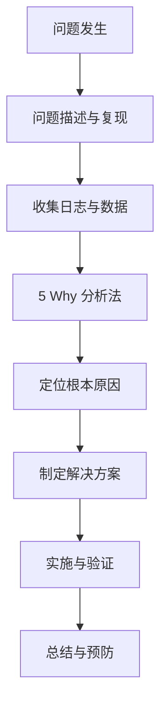

# Root Cause Analysis (RCA) - 根因分析报告

本目录收录了项目中遇到的关键技术问题的根因分析、解决方案和最佳实践总结。

---

## 📋 报告列表

### 已完成的 RCA

| 编号 | 主题 | 严重程度 | 状态 |
|------|------|----------|------|
| **[RCA-001](RCA-001-deepseek-reasoner-truncation.md)** | DeepSeek Reasoner 流式输出截断修复 | 🔴 高 | ✅ 已解决 |
| **[RCA-002](RCA-002-streaming-parser-prefix-collision.md)** | 流式解析器前缀冲突问题 | 🟡 中 | ✅ 已解决 |

### 最佳实践

| 文档 | 说明 |
|------|------|
| **[PARSING-BEST-PRACTICES.md](PARSING-BEST-PRACTICES.md)** | 流式解析最佳实践指南 |

---

## 🔬 RCA 方法论

### 分析流程



### 5 Why 分析法

连续追问"为什么"至少 5 次，直到找到根本原因：

1. **Why 1**: 为什么会出现这个问题？
2. **Why 2**: 为什么会导致这个条件？
3. **Why 3**: 为什么没有检测到这个异常？
4. **Why 4**: 为什么设计时没有考虑这个场景？
5. **Why 5**: 为什么流程中没有这个检查点？

---

## 📝 RCA 报告模板

```markdown
# RCA-XXX: 问题标题

## 1. 问题描述
- **发生时间**: YYYY-MM-DD HH:MM
- **影响范围**: 影响的功能模块和用户群体
- **严重程度**: 高/中/低
- **问题现象**: 用户反馈的具体表现

## 2. 时间线
- **HH:MM** - 问题首次出现
- **HH:MM** - 收到用户反馈
- **HH:MM** - 开始排查
- **HH:MM** - 定位根因
- **HH:MM** - 实施修复
- **HH:MM** - 验证通过

## 3. 根因分析
### 3.1 直接原因
导致问题的直接技术原因。

### 3.2 深层原因
使用 5 Why 分析法找到的系统性原因。

### 3.3 促成因素
哪些条件促成了问题的发生。

## 4. 解决方案
### 4.1 临时措施
立即采取的应急方案。

### 4.2 永久修复
根本性解决方案。

### 4.3 验证方法
如何确认问题已解决。

## 5. 经验教训
- 学到了什么
- 哪些流程需要改进
- 如何防止类似问题再次发生

## 6. 行动项
- [ ] 行动项 1（负责人，截止日期）
- [ ] 行动项 2
- [ ] 行动项 3

## 7. 相关文档
- 链接到相关的代码提交、测试用例、文档更新
```

---

## 🎯 问题分类

### 按类型

**性能问题**
- 响应超时
- Token 限制
- 资源泄漏

**功能问题**
- 逻辑错误
- 边界条件
- 兼容性问题

**架构问题**
- 模块耦合
- 单点故障
- 扩展性瓶颈

**用户体验问题**
- 界面错误
- 交互异常
- 数据展示问题

### 按严重程度

🔴 **高 (High)**
- 核心功能不可用
- 数据丢失风险
- 大面积用户影响

🟡 **中 (Medium)**
- 部分功能受限
- 性能下降
- 特定场景触发

🟢 **低 (Low)**
- 轻微体验问题
- 边缘场景
- 有替代方案

---

## 📊 RCA-001 案例研究

### 问题背景
用户在使用 DeepSeek Reasoner 模型生成复杂 HTML 页面时，输出在中间被截断。

### 根因分析

**直接原因**: `max_output_tokens` 设置为 8192，不足以承载长文本输出。

**深层原因**:
1. 为什么没有提前发现？→ 缺少长文本生成测试场景
2. 为什么限制这么低？→ 默认配置未针对复杂场景优化
3. 为什么没有自动续写？→ 缺少长度检测和续写机制

**促成因素**:
- 推理内容占用大量 Token
- HTML 生成本身需要 15K+ 字符
- Fallback 逻辑未传递配置

### 解决方案

1. **配置优化**: 调整 `max_output_tokens` 到 API 上限
2. **自动续写**: 实现长度检测和链式生成机制
3. **前端提示**: 当检测到截断时显示"继续生成"按钮

### 经验教训

- ✅ 添加长文本生成测试用例
- ✅ 实现自动续写架构
- ✅ 完善配置验证逻辑

详见：[RCA-001](RCA-001-deepseek-reasoner-truncation.md)

---

## 🔄 维护指南

### 何时创建 RCA

遇到以下情况时应创建 RCA 报告：

1. **生产事故**: 影响用户使用的故障
2. **重复问题**: 同一问题出现 2 次以上
3. **重大修复**: 需要重构代码的 bug 修复
4. **性能问题**: 响应时间超过阈值

### 回顾与更新

- **季度回顾**: 每季度回顾已解决的 RCA
- **模式识别**: 识别重复出现的问题模式
- **流程改进**: 根据 RCA 改进开发流程

---

## 📚 相关资源

### 内部文档
- [测试指南](../guides/developer/TESTING.md) - 测试规范
- [架构设计](../architecture/) - 系统架构
- [执行计划](../plans/INDEX.md) - 改进任务追踪

### 外部资源
- [5 Why 分析法](https://en.wikipedia.org/wiki/Five_whys)
- [根因分析最佳实践](https://www.atlassian.com/incident-management/postmortem)
- [事故响应指南](https://landing.google.com/sre/workbook/chapters/incident-response/)

---

**最后更新**: 2026-03-24  
**维护者**: Yue Project Team
