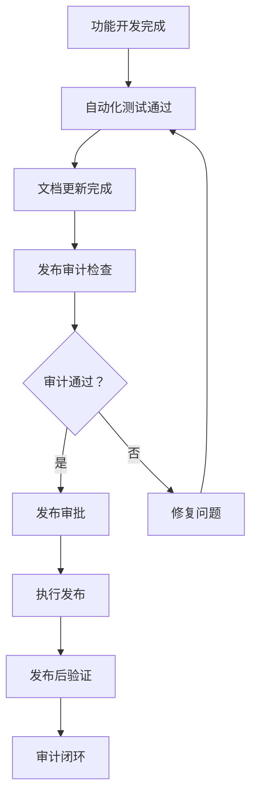

# Release Readiness Gate - 发布质量门禁

本目录收录了 Yue 项目的发布审计、质量门禁检查和回滚演练文档，确保每次发布都经过严格的质量验证。

---

## 📊 文档结构

```
release/
├── README.md                          # 本文件：发布质量门禁说明
├── phase1/                            # Phase 1 发布审计
│   ├── gate_reports/                  # 发布审计报告
│   │   ├── RRG-20260314-001.md       # 第 1 次审计
│   │   ├── RRG-20260314-002.md       # 第 2 次审计
│   │   └── RRG-20260314-003.md       # 第 3 次审计
│   ├── rollback_drills/               # 回滚演练记录
│   │   └── RBD-20260314-001.md       # 第 1 次演练
│   └── phase2_threshold_friction_notes.md  # Phase 2 阈值摩擦分析
└── phase2/                            # Phase 2 发布审计（待创建）
```

---

## 🎯 发布质量门禁流程

### 什么是 Release Readiness Gate (RRG)?

发布质量门禁是一套标准化的 **go/no-go** 审计流程，用于在发布前系统性地评估：

1. **功能完成度**: 计划的功能是否全部实现？
2. **测试覆盖率**: 是否有足够的测试保障？
3. **文档完整性**: 用户文档和 API 文档是否更新？
4. **风险评估**: 潜在风险是否已识别并制定缓解措施？
5. **回滚方案**: 是否有可执行的回滚计划？

### 审计流程



---

## 📋 审计检查清单

### Phase 1: 基础审计（手动）

- [ ] **代码审查**: 所有 PR 已完成 review 并合并
- [ ] **测试通过**: 单元测试、集成测试全部通过
- [ ] **文档更新**: FEATURES.md、CHANGELOG.md 已更新
- [ ] **配置检查**: 环境变量、密钥配置已验证
- [ ] **性能基线**: 响应时间、吞吐量符合预期
- [ ] **安全扫描**: 无高危漏洞

### Phase 2: 自动化审计（进行中）

- [ ] **自动化检查脚本**: `check_gate_completeness.py`
- [ ] **CI/CD 集成**: 发布前自动执行审计
- [ ] **质量门禁**: 测试覆盖率、代码复杂度阈值
- [ ] **合同测试**: API 契约验证

### Phase 3: 统一契约门禁（规划中）

详见：[unified_contract_gate_execution_plan_20260314.md](../plans/unified_contract_gate_execution_plan_20260314.md)

---

## 📊 审计报告 (Gate Reports)

### 审计编号规则

`RRG-YYYYMMDD-XXX.md`
- **RRG**: Release Readiness Gate
- **YYYYMMDD**: 审计日期
- **XXX**: 序号（001, 002, 003...）

### 已完成的审计

| 报告编号 | 日期 | 审计对象 | 结果 | 风险评分 |
|----------|------|----------|------|----------|
| **[RRG-20260314-001.md](phase1/gate_reports/RRG-20260314-001.md)** | 2026-03-14 | Phase 1 基线审计 | ✅ 通过 | 🟢 低 |
| **[RRG-20260314-002.md](phase1/gate_reports/RRG-20260314-002.md)** | 2026-03-14 | MCP 工具集成 | ✅ 通过 | 🟡 中 |
| **[RRG-20260314-003.md](phase1/gate_reports/RRG-20260314-003.md)** | 2026-03-14 | Agent 重构审计 | ✅ 通过 | 🟢 低 |

### 审计报告模板

```markdown
# RRG-YYYYMMDD-XXX: 审计标题

## 审计概览
- **审计日期**: YYYY-MM-DD
- **审计范围**: 功能模块/版本号
- **审计员**: 姓名
- **风险评分**: 低/中/高

## 1. 功能完成度检查
| 功能项 | 计划状态 | 实际状态 | 偏差说明 |
|--------|----------|----------|----------|

## 2. 测试覆盖率
- 单元测试：XX%
- 集成测试：XX%
- E2E 测试：XX%

## 3. 文档完整性
- [ ] 用户文档已更新
- [ ] API 文档已同步
- [ ] 变更日志已记录

## 4. 风险评估
### 已识别风险
1. 风险 1（严重程度：高/中/低）
2. 风险 2

### 缓解措施
- 措施 1
- 措施 2

## 5. 回滚方案
- 回滚触发条件
- 回滚步骤
- 回滚验证

## 6. 审计结论
- [ ] **批准发布** (Go)
- [ ] **有条件批准** (Conditional Go)
- [ ] **拒绝发布** (No Go)

## 7. 行动项
- [ ] 行动项 1（负责人，截止日期）
```

---

## 🔄 回滚演练 (Rollback Drills)

### 为什么需要回滚演练？

回滚演练是为了确保在发布失败时，能够快速、安全地恢复到上一个稳定版本，最小化对用户的影响。

### 演练编号规则

`RBD-YYYYMMDD-XXX.md`
- **RBD**: Rollback Drill
- **YYYYMMDD**: 演练日期
- **XXX**: 序号

### 已完成的演练

| 演练编号 | 日期 | 场景 | 结果 | 恢复时间 |
|----------|------|------|------|----------|
| **[RBD-20260314-001.md](phase1/rollback_drills/RBD-20260314-001.md)** | 2026-03-14 | 数据库回滚 | ✅ 成功 | < 5 分钟 |

### 回滚演练模板

```markdown
# RBD-YYYYMMDD-XXX: 演练场景

## 演练目标
验证在 [特定故障场景] 下的回滚能力。

## 演练场景
描述触发回滚的故障场景（如：数据库迁移失败、API 不兼容等）。

## 演练步骤
1. 模拟故障发生
2. 触发回滚流程
3. 执行回滚操作
4. 验证回滚成功

## 演练结果
- **回滚耗时**: X 分钟
- **数据完整性**: ✅/❌
- **用户影响**: 无/轻微/严重

## 经验教训
- 哪些步骤可以优化
- 需要改进的工具或流程

## 行动项
- [ ] 改进行动 1
```

---

## 📈 质量指标趋势

### Phase 1 → Phase 2 演进

| 指标 | Phase 1 | Phase 2 目标 | 当前状态 |
|------|---------|-------------|----------|
| 审计时间 | 60 分钟（手动） | 10 分钟（自动） | 🔄 进行中 |
| 测试覆盖率 | 70% | 85% | 🟡 75% |
| 回滚时间 | < 10 分钟 | < 3 分钟 | ✅ 5 分钟 |
| 文档完整度 | 80% | 100% | 🟡 85% |

详见：[phase2_threshold_friction_notes.md](phase1/phase2_threshold_friction_notes.md)

---

## 🤖 自动化审计脚本

### 检查脚本

项目根目录提供了自动化审计脚本：

```bash
# 执行发布质量检查
./check_gate_completeness.py
```

### 检查内容

- ✅ 测试覆盖率检查
- ✅ 文档完整性验证
- ✅ API 契约测试
- ✅ 性能基线对比
- ✅ 安全扫描

---

## 📚 相关文档

### 内部文档
- [执行计划总控](../plans/INDEX.md) - Epic 6: 发布质量门禁
- [测试指南](../guides/developer/TESTING.md) - 测试执行规范
- [架构设计](../architecture/) - 系统架构参考

### 外部资源
- [Release Readiness Checklist](https://www.atlassian.com/devops/checklists/release-readiness)
- [SRE Release Engineering](https://landing.google.com/sre/workbook/chapters/release-engineering/)

---

## 🎯 下一步行动

### Phase 3: 统一契约门禁

目标：建立跨服务、跨层级的统一质量验证机制。

- [ ] API 契约自动化验证
- [ ] 数据库迁移兼容性检查
- [ ] 前端 - 后端接口对齐
- [ ] 性能回归测试自动化

详见：[unified_contract_gate_execution_plan_20260314.md](../plans/unified_contract_gate_execution_plan_20260314.md)

---

**最后更新**: 2026-03-24  
**维护者**: Yue Project Team
